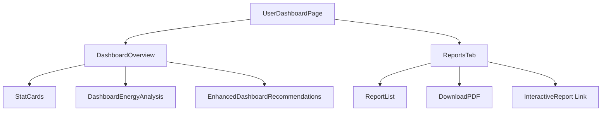
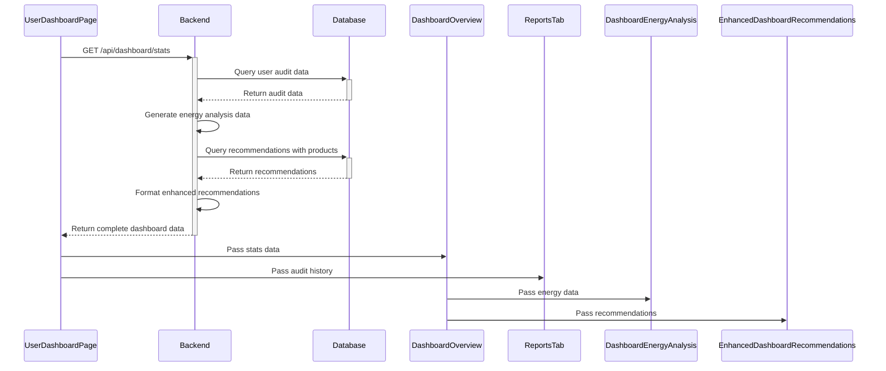

# Dashboard Streamline Redesign Implementation Plan

## 1. Overview

### 1.1 Purpose
This plan outlines the steps to streamline the dashboard by removing redundant Recommendations and Product Comparisons tabs, while enhancing the Overview tab with more robust Energy Analysis and Recommendations sections from the Interactive Reports feature.

### 1.2 Background
Currently, the dashboard has four tabs:
- Overview (with Monthly Savings Trend chart and basic Recommendations)
- Recommendations (standalone with limited functionality)
- Product Comparisons (standalone)
- Reports (with Interactive Report feature)

The Interactive Reports feature has evolved to provide superior functionality compared to the standalone Recommendations and Product Comparisons tabs, making them redundant. This redesign will consolidate functionality and improve the user experience.

### 1.3 Goals
- Eliminate redundant tabs (Recommendations and Product Comparisons)
- Enhance Overview tab with robust Energy Analysis and Recommendations
- Ensure a streamlined, coherent user experience
- Maintain all valuable functionality while reducing UI complexity

## 2. Git Branching Strategy

- **Branch name**: `feature/dashboard-streamline-redesign`
- **Base branch**: `main`
- **Commit strategy**: Make atomic, logical commits with descriptive messages
- **Deployment**: Manual deployment to Heroku after PR approval (NO deployment scripts)

## 3. Detailed Component Modifications

### 3.1. UserDashboardPage.tsx Changes

#### 3.1.1. Import Modifications
- Remove the following imports:
```typescript
import RecommendationsTab from '@/components/dashboard/RecommendationsTab';
import ProductComparisons from '@/components/dashboard/ProductComparisons';
```
- Add imports for new components:
```typescript
import DashboardEnergyAnalysis from '@/components/dashboard/DashboardEnergyAnalysis';
import EnhancedDashboardRecommendations from '@/components/dashboard/EnhancedDashboardRecommendations';
```

#### 3.1.2. State Management Updates
- Modify tab selection state to only include 'overview' and 'reports':
```typescript
// Current
const [activeTab, setActiveTab] = useState('overview');

// Ensure default works with reduced tabs
const validTabs = ['overview', 'reports'];
const [activeTab, setActiveTab] = useState(validTabs[0]);
```

#### 3.1.3. Tab Navigation Modifications
- Remove Recommendations and Product Comparisons buttons from the tab navigation:
```tsx
// Current tabs
<button onClick={() => setActiveTab('overview')}>Overview</button>
<button onClick={() => setActiveTab('recommendations')}>Recommendations</button>
<button onClick={() => setActiveTab('products')}>Product Comparisons</button>
<button onClick={() => setActiveTab('reports')}>Reports</button>

// Modified tabs
<button onClick={() => setActiveTab('overview')}>Overview</button>
<button onClick={() => setActiveTab('reports')}>Reports</button>
```

#### 3.1.4. Conditional Rendering Updates
- Remove conditional rendering for Recommendations and Product Comparisons tabs:
```tsx
// Current
{activeTab === 'recommendations' && (
  <RecommendationsTab 
    recommendations={stats.recommendations || []} 
    onUpdate={() => setRefreshKey(prev => prev + 1)} 
  />
)}

{activeTab === 'products' && (
  <ProductComparisons 
    userId={stats.userId || ''} 
    audits={stats.completedAudits} 
  />
)}

// Remove these sections entirely
```

#### 3.1.5. DashboardStats Interface Update
- Update the DashboardStats interface to include data needed for energy analysis:
```typescript
interface DashboardStats {
  // Existing fields
  totalSavings: {
    estimated: number;
    actual: number;
    accuracy: number;
  };
  completedAudits: number;
  activeRecommendations: number;
  implementedChanges: number;
  monthlySavings: {
    month: string;
    estimated: number;
    actual: number;
  }[];
  
  // New fields for enhanced features
  energyAnalysis?: {
    energyBreakdown: ChartDataPoint[];
    consumption: ChartDataPoint[];
    savingsAnalysis: SavingsChartDataPoint[];
  };
  enhancedRecommendations?: AuditRecommendation[];
  productPreferences?: {
    categories: string[];
    budgetConstraint?: number;
  };
  latestAuditId?: string | null;
  recommendations?: any[];
  userId?: string;
}
```

### 3.2. New Component Creation

#### 3.2.1. DashboardEnergyAnalysis.tsx
Create a new component that adapts the ReportCharts component for dashboard use.

#### 3.2.2. EnhancedDashboardRecommendations.tsx
Create a simplified version of the EnhancedReportRecommendations component for the dashboard.

### 3.3. DashboardOverview Component Updates

Update the DashboardOverview component to use the new Energy Analysis and Enhanced Recommendations components:
- Replace the Monthly Savings Trend with Energy Analysis section
- Replace simple RecommendationCard with EnhancedDashboardRecommendations

```typescript
// Add to the return statement of DashboardOverview
{/* Enhanced Recommendations Section - Replace the old recommendations section */}
{stats.enhancedRecommendations && stats.enhancedRecommendations.length > 0 ? (
  <EnhancedDashboardRecommendations
    recommendations={stats.enhancedRecommendations}
    userCategories={stats.productPreferences?.categories || []}
    budgetConstraint={stats.productPreferences?.budgetConstraint}
    auditId={stats.latestAuditId}
    onRefresh={onRefresh}
  />
) : (
  // Fallback to old recommendations if enhanced data not available
  <div className="bg-white rounded-lg shadow-sm p-4 sm:p-6 mx-0">
    <h2 className="text-lg font-semibold text-gray-900 mb-4">Recommendations</h2>
    {stats.recommendations && stats.recommendations.length > 0 ? (
      <div className="space-y-4">
        {stats.recommendations.map((recommendation) => (
          <RecommendationCard
            key={recommendation.id}
            recommendation={recommendation}
            onUpdate={onRefresh}
          />
        ))}
      </div>
    ) : (
      <div className="text-center text-gray-500 py-6">
        <p>No recommendations available.</p>
        <button
          onClick={() => window.location.href = '/energy-audit'}
          className="mt-4 px-4 py-2 bg-green-600 text-white text-sm rounded-md hover:bg-green-700 w-full sm:w-auto"
        >
          Start New Energy Audit
        </button>
      </div>
    )}
  </div>
)}
```

## 4. Backend API Modifications

### 4.1. Dashboard API Endpoint Enhancement

The dashboard API endpoint needs to be enhanced to include energy analysis data and enhanced recommendation data. This will require modifications to:

#### 4.1.1. energyAudit.ts Controller

Add or modify the appropriate functions to fetch the energy analysis data:

```typescript
// backend/src/routes/energyAudit.ts
// Inside the getDashboardStats function or create a new helper function

// Add Energy Analysis data to the response
const energyAnalysisData = await getEnergyAnalysisData(auditId);

// Add Enhanced Recommendations with product suggestions
const enhancedRecommendations = await getEnhancedRecommendations(auditId);

// Add user product preferences
const productPreferences = await getProductPreferences(userId);

// Return in the response
return {
  // Existing fields
  totalSavings,
  completedAudits,
  activeRecommendations,
  implementedChanges,
  monthlySavings,
  
  // New fields
  energyAnalysis: energyAnalysisData,
  enhancedRecommendations,
  productPreferences,
  latestAuditId: auditId,
  // Keep backward compatibility
  recommendations: enhancedRecommendations
};
```

#### 4.1.2. Helper Functions

Create helper functions to generate or fetch the required data:

```typescript
// Backend function to get Energy Analysis data
async function getEnergyAnalysisData(auditId: string) {
  // Fetch from database or generate data based on audit
  
  // Example structure
  return {
    energyBreakdown: [
      { name: 'HVAC', value: 4500 },
      { name: 'Lighting', value: 2300 },
      { name: 'Appliances', value: 1800 },
      { name: 'Electronics', value: 1200 },
      { name: 'Other', value: 800 }
    ],
    consumption: [
      { name: 'Jan', value: 890 },
      { name: 'Feb', value: 820 },
      // ... other months
    ],
    savingsAnalysis: [
      { name: 'HVAC', estimatedSavings: 520, actualSavings: 480 },
      { name: 'Lighting', estimatedSavings: 320, actualSavings: 290 },
      // ... other categories
    ]
  };
}

// Backend function to get Enhanced Recommendations with product suggestions
async function getEnhancedRecommendations(auditId: string) {
  // Fetch recommendations from database
  const recommendations = await db.recommendations.findMany({
    where: { auditId }
  });
  
  // Transform to AuditRecommendation format with additional data
  return recommendationsWithEnhancedData(recommendations);
}

// Backend function to get User Product Preferences
async function getProductPreferences(userId: string) {
  // Fetch user preferences from database
  const preferences = await db.userPreferences.findUnique({
    where: { userId }
  });
  
  return {
    categories: preferences?.categories || [],
    budgetConstraint: preferences?.budgetConstraint || null
  };
}
```

#### 4.1.3. Types Update

Update TypeScript interfaces in both backend and frontend:

```typescript
// shared/types.ts or equivalent

// Add these interfaces or extend existing ones
interface EnergyAnalysisData {
  energyBreakdown: ChartDataPoint[];
  consumption: ChartDataPoint[];
  savingsAnalysis: SavingsChartDataPoint[];
}

interface ChartDataPoint {
  name: string;
  value: number;
}

interface SavingsChartDataPoint {
  name: string;
  estimatedSavings: number;
  actualSavings: number;
}

interface UserProductPreferences {
  categories: string[];
  budgetConstraint?: number;
}
```

## 5. Testing Strategy

### 5.1. Unit Tests

Create or update unit tests for:

- New components: DashboardEnergyAnalysis and EnhancedDashboardRecommendations
- Modified components: UserDashboardPage and DashboardOverview
- API endpoints and controller functions

Key aspects to test:
- Verify components render correctly with different data inputs
- Test conditional rendering and fallback behavior
- Validate dashboard stats transformations
- Test filtering and sorting of recommendations

```typescript
// Example test for DashboardEnergyAnalysis component
describe('DashboardEnergyAnalysis', () => {
  it('renders energy breakdown chart', () => {
    const mockData = {
      energyBreakdown: [{ name: 'HVAC', value: 500 }],
      consumption: [{ name: 'Jan', value: 100 }],
      savingsAnalysis: [{ name: 'HVAC', estimatedSavings: 50, actualSavings: 40 }]
    };
    
    const { getByText } = render(<DashboardEnergyAnalysis data={mockData} />);
    
    expect(getByText('Energy Analysis')).toBeInTheDocument();
    expect(getByText('Energy Breakdown')).toBeInTheDocument();
    // Test chart rendering...
  });
  
  it('displays fallback message when no data is available', () => {
    const { getByText } = render(<DashboardEnergyAnalysis data={undefined} />);
    
    expect(getByText('No energy analysis data available.')).toBeInTheDocument();
  });
});
```

### 5.2. Integration Tests

Test the integration between:
- Frontend dashboard and backend API
- Energy Analysis data fetching and display
- Enhanced Recommendations and interaction with Reports functionality

```typescript
// Example integration test for dashboard data fetching
describe('Dashboard Integration', () => {
  it('fetches and displays energy analysis data', async () => {
    // Mock API response
    jest.spyOn(global, 'fetch').mockImplementation(() => 
      Promise.resolve({
        ok: true,
        json: () => Promise.resolve({
          // Mock dashboard data with energyAnalysis
        })
      })
    );
    
    const { getByText, findByText } = render(<UserDashboardPage />);
    
    // Verify API called and data displayed
    expect(await findByText('Energy Analysis')).toBeInTheDocument();
    // Verify charts rendered...
  });
});
```

### 5.3. End-to-End Tests

Key user flows to test:
- Navigating between Overview and Reports tabs
- Viewing recommendations in Overview
- Clicking "View All Recommendations & Details" to navigate to Reports
- Interaction with charts in Energy Analysis section

```typescript
// Example Cypress E2E test
describe('Dashboard User Flow', () => {
  beforeEach(() => {
    cy.login();
    cy.visit('/dashboard');
  });
  
  it('should navigate between tabs and show energy analysis', () => {
    cy.contains('Overview').click();
    cy.contains('Energy Analysis').should('be.visible');
    
    cy.contains('Reports').click();
    cy.contains('Energy Audit Reports').should('be.visible');
    
    cy.contains('Overview').click();
    cy.contains('View All Recommendations & Details').click();
    cy.url().should('include', '/reports/');
  });
});
```

### 5.4. Performance Testing

- Measure initial load time of the dashboard
- Compare before and after redesign
- Verify chart rendering performance
- Test responsive behavior on different devices

## 6. Documentation Updates

### 6.1. Component Documentation

Update documentation for the modified and new components in energy-audit-vault:

#### 6.1.1. UserDashboardPage.md

```markdown
---
title: "UserDashboardPage"
type: "Page Component"
path: "src/pages/UserDashboardPage.tsx"
description: "Main dashboard page for users to view energy metrics and reports"
tags: [dashboard, overview, reports]
status: "up-to-date"
last_verified: "2025-04-05"
---

## Overview

The UserDashboardPage provides a central view of a user's energy audit information, including savings metrics, recommendations, and access to detailed reports.

## Key Features

- Key metrics cards showing savings, audit counts, and improvements
- Energy Analysis section with detailed breakdown of energy use and savings
- Enhanced Recommendations section with prioritized efficiency improvements
- Access to detailed Interactive Reports
- Responsive design for all device sizes

## Component Structure



## Implementation Notes

- The dashboard no longer contains the separate Recommendations and Product Comparisons tabs, as this functionality has been consolidated into the Overview and Reports sections
- Overview tab now contains the enhanced Energy Analysis section which replaces the older Monthly Savings Trend chart
- The Recommendations section now uses the EnhancedDashboardRecommendations component which provides richer information and direct links to Interactive Reports
```

#### 6.1.2. DashboardEnergyAnalysis.md

```markdown
---
title: "DashboardEnergyAnalysis"
type: "Component"
path: "src/components/dashboard/DashboardEnergyAnalysis.tsx"
description: "Energy analysis visualization component for the dashboard"
tags: [chart, energy, visualization, dashboard]
status: "up-to-date"
last_verified: "2025-04-05"
---

## Overview

The DashboardEnergyAnalysis component displays a comprehensive visualization of the user's energy usage and savings data using multiple chart types.

## Key Features

- Energy Breakdown Pie Chart - Shows distribution of energy usage by category
- Energy Consumption Bar Chart - Displays energy usage over time or by category
- Savings Analysis Bar Chart - Compares estimated versus actual savings

## Props Interface

```typescript
interface EnergyAnalysisProps {
  data: {
    energyBreakdown: ChartDataPoint[];
    savingsAnalysis: SavingsChartDataPoint[];
    consumption: ChartDataPoint[];
  };
  isLoading?: boolean;
}
```

## Dependencies / Imports

- Recharts library for all visualizations (PieChart, BarChart, etc.)
- Financial utilities for formatting currency values
- Responsive container for mobile adaptation

## Related Components

- [[DashboardOverview]] - Parent component that contains this energy analysis section
```

### 6.2. Data Flow Documentation Updates

Update the data flow documentation to reflect the new structure:

```markdown
---
title: "Dashboard Data Flow"
type: "Data Flow"
description: "Data flow for the user dashboard"
tags: [dashboard, api, data-flow]
status: "up-to-date"
last_verified: "2025-04-05"
---

## Overview

The dashboard data flow has been streamlined to consolidate recommendations and product data within the Energy Analysis and enhanced recommendations features.

## Data Flow Diagram



## Data Structures

### API Request
- GET `/api/dashboard/stats`
- Optional query parameter: `?auditId=123` to specify a particular audit

### API Response
```typescript
{
  totalSavings: { estimated: number, actual: number, accuracy: number },
  completedAudits: number,
  activeRecommendations: number,
  implementedChanges: number,
  monthlySavings: Array<{ month: string, estimated: number, actual: number }>,
  
  // New data structures
  energyAnalysis: {
    energyBreakdown: Array<{ name: string, value: number }>,
    consumption: Array<{ name: string, value: number }>,
    savingsAnalysis: Array<{ name: string, estimatedSavings: number, actualSavings: number }>
  },
  enhancedRecommendations: Array<AuditRecommendation>,
  productPreferences: { categories: string[], budgetConstraint: number },
  latestAuditId: string
}
```
```

## 7. Detailed Checklist of Deliverables

### 7.1. Frontend Components

- [ ] **UserDashboardPage.tsx Modifications**
  - [ ] Remove Recommendations and Product Comparisons tab buttons
  - [ ] Remove imports of removed components
  - [ ] Update tab state management
  - [ ] Remove conditional rendering of removed components
  - [ ] Update component JSDoc comments

- [ ] **Create New Components**
  - [ ] DashboardEnergyAnalysis.tsx
  - [ ] EnhancedDashboardRecommendations.tsx
  - [ ] Add appropriate TypeScript interfaces
  - [ ] Write JSDoc comments

- [ ] **Update DashboardOverview Component**
  - [ ] Replace Monthly Savings Trend with Energy Analysis section
  - [ ] Replace basic recommendations with Enhanced Recommendations component
  - [ ] Add conditional fallback for when new data isn't available

### 7.2. Backend API Enhancements

- [ ] **API Endpoint Updates**
  - [ ] Modify dashboard stats endpoint to include energy analysis data
  - [ ] Add enhanced recommendations with product data
  - [ ] Add user product preferences
  - [ ] Maintain backward compatibility

- [ ] **Helper Functions**
  - [ ] Create getEnergyAnalysisData function
  - [ ] Create getEnhancedRecommendations function
  - [ ] Create getProductPreferences function

- [ ] **Type Definitions**
  - [ ] Create or update TypeScript interfaces for new data structures
  - [ ] Ensure consistent types between frontend and backend

### 7.3. Tests

- [ ] **Unit Tests**
  - [ ] Test DashboardEnergyAnalysis component
  - [ ] Test EnhancedDashboardRecommendations component
  - [ ] Test modified UserDashboardPage component
  - [ ] Test API endpoints and controller functions

- [ ] **Integration Tests**
  - [ ] Test dashboard data fetching
  - [ ] Test interaction between components
  - [ ] Test navigation between dashboard and reports

- [ ] **Manual Testing**
  - [ ] Verify responsive design on different screen sizes
  - [ ] Test all user interactions
  - [ ] Verify chart rendering and interactions
  - [ ] Test accessibility features

### 7.4. Documentation

- [ ] **Component Documentation**
  - [ ] Update UserDashboardPage.md
  - [ ] Create DashboardEnergyAnalysis.md
  - [ ] Create EnhancedDashboardRecommendations.md
  - [ ] Update DashboardOverview.md

- [ ] **Data Flow Documentation**
  - [ ] Update dashboard-data-flow.md
  - [ ] Create sequence diagrams for new flows
  - [ ] Document API changes

- [ ] **Code Comments**
  - [ ] Add/update JSDoc comments for all components and functions
  - [ ] Annotate complex sections and business logic

### 7.5. Deployment

- [ ] **Git Changes**
  - [ ] Create feature branch
  - [ ] Make commits with clear, descriptive messages
  - [ ] Create PR with detailed description

- [ ] **Deployment Steps**
  - [ ] Manual deployment to Heroku
  - [ ] Verify functionality in production environment
  - [ ] Monitor for any performance issues

## 8. Timeline

### Phase 1: Development (Days 1-3)

#### Day 1
- Create feature branch
- Remove Recommendations and Product Comparisons tabs
- Create skeleton versions of new components

#### Day 2
- Implement DashboardEnergyAnalysis component
- Update backend API to include energy analysis data
- Write unit tests for new component

#### Day 3
- Implement EnhancedDashboardRecommendations component
- Update DashboardOverview to use new components
- Write unit tests for updated components

### Phase 2: Testing and Documentation (Days 4-5)

#### Day 4
- Complete all unit and integration tests
- Perform manual testing on different devices
- Address any bugs or issues found

#### Day 5
- Update component documentation
- Update data flow documentation
- Create PR for review

### Phase 3: Deployment (Day 6)

#### Day 6
- Address PR feedback
- Manual deployment to Heroku
- Post-deployment verification
- Monitor performance and user feedback

## 9. Conclusion

This implementation plan outlines a complete strategy for streamlining the dashboard by removing redundant tabs while enhancing the Overview section with more comprehensive Energy Analysis and Recommendations features from the Interactive Reports. The plan ensures that all valuable functionality is maintained while significantly improving the user experience.

The detailed component designs, API changes, testing strategy, and documentation updates provide a clear roadmap for implementation. By following this plan, we can deliver a more coherent, user-friendly dashboard that focuses on presenting the most valuable information to users.
