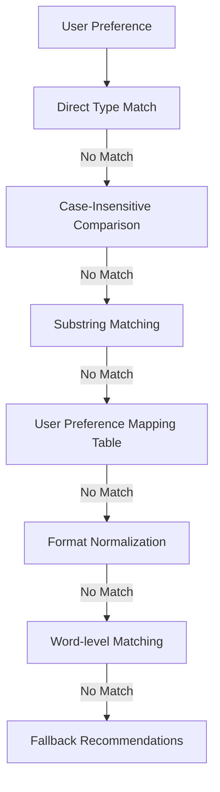

# Category Mapping Implementation

## Overview

This document outlines the implementation details of the enhanced category mapping system used in our recommendation filtering. The system bridges the gap between user preferences and recommendation categories, ensuring users see relevant recommendations regardless of minor naming variations.

## Problem Statement

We encountered issues where user preferences (such as 'renewable', 'smart_home', 'water_heating') didn't match recommendation categories due to format inconsistencies:

1. **Format Variations**: Underscores vs dashes ('water_heating' vs 'water-heating')
2. **Category Hierarchy Mismatches**: User preferences using simpler terms than category hierarchies (e.g., 'renewable' vs 'Electronics > Renewable Energy')
3. **Different Naming Conventions**: Backend and frontend using different names for the same concepts
4. **Missing Fallback Behavior**: Empty recommendation sections when no exact matches were found

## Solution Architecture

### 1. Multi-layered Mapping System

We implemented a comprehensive category mapping system with multiple fallback layers:



### 2. Preference-to-Category Mapping

The core of the system is the `userPreferenceToCategory` mapping table, which maps each user preference to all possible category variations:

```typescript
const userPreferenceToCategory: Record<string, string[]> = {
  'renewable': ['Electronics', 'Renewable Energy', 'Solar', 'renewable', 'renewable_energy', 'renewable-energy'],
  'smart_home': ['Electronics', 'Smart Home', 'smart_home', 'smart-home', 'smart_home_devices'],
  'water_heating': ['Water Heaters', 'water_heating', 'water-heating', 'water heating'],
  // ... additional mappings
};
```

### 3. Special Case Direct Matching

For the most problematic category combinations, we added direct type matching:

```typescript
// Special case direct matches for problematic categories
if ((preference === 'renewable' && 
      (category === 'renewable' || category === 'renewable_energy')) ||
    (preference === 'smart_home' && 
      (category === 'smart_home' || category === 'smart-home')) ||
    (preference === 'water_heating' && 
      (category === 'water_heating' || category === 'water-heating'))) {
  return true;
}
```

### 4. Fallback Matching Layers

We implemented multiple matching strategies:
- Format normalization (underscores to dashes and vice versa)
- Substring matching
- Word-level matching 
- Fallback to default recommendations when no matches found

### 5. Enhanced Logging

Added detailed logging throughout the filtering process:
- Input/output of each filtering stage
- Exact match attempts and results
- Fallback behavior activation

## Implementation Details

### Category Matching Function

The `isPreferenceMatchingCategory` function checks if a user preference matches a category:

```typescript
const isPreferenceMatchingCategory = (preference: string, category: string): boolean => {
  // Special case direct matches for problematic categories
  if ((preference === 'renewable' && 
       (category === 'renewable' || category === 'renewable_energy'))) {
    console.log(`DIRECT TYPE MATCH found for '${preference}' and '${category}'`);
    return true;
  }
  
  // Direct match (case-insensitive)
  if (preference.toLowerCase() === category.toLowerCase()) {
    console.log(`Direct match found for '${preference}' and '${category}'`);
    return true;
  }
  
  // Additional matching layers
  // ...
  
  return false;
};
```

### Multi-stage Filtering Process

The `filterRecommendationsByUserPreferences` function uses a multi-stage approach:

1. **Direct Type Matching**: Check for exact type matches first
2. **Standard Category Matching**: Use the mapping table and matching function
3. **Flexible Matching**: Split preferences into keywords for partial matches
4. **Category-specific Fallbacks**: Provide special handling for key categories
5. **Default Fallback**: Return a subset of recommendations if all else fails

## Debugging and Troubleshooting

Common issues and debugging patterns:

1. **No Recommendations Showing**: Check browser console for "No matches found" messages
   - Verify user preferences are correctly loaded
   - Look for "Checking recommendation with categories" logs to verify mapping

2. **Incorrect Recommendations**: Use flexible matching logs to understand which keyword matches triggered the recommendation

3. **Unexpected Category Matches**: Review direct type matches and format normalization logs

## Future Improvements

1. **Configuration-Based Mapping**: Move hardcoded mappings to a configuration file
2. **Standardized Category Types**: Use consistent naming conventions across backend and frontend
3. **Machine Learning Approach**: Consider implementing a more sophisticated matching algorithm
4. **User Customization**: Allow users to provide custom mappings and preferences

## Testing the Mapping System

Test the category mapping by:

1. Setting different user preferences in your profile
2. Checking the browser console for filtering logs
3. Verifying recommendations shown match the expected categories
4. Testing edge cases with unusual category combinations
