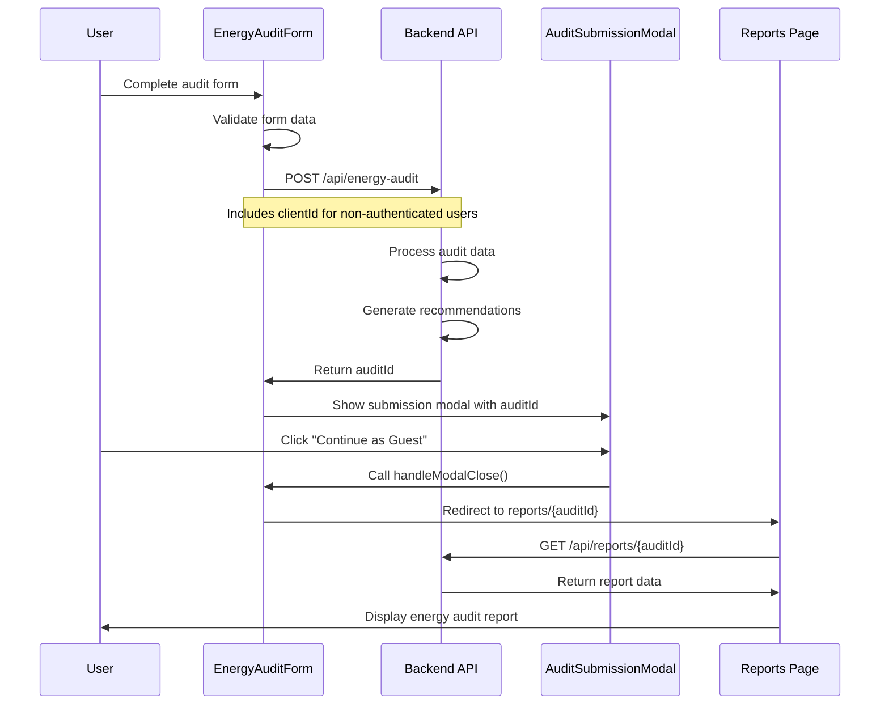

## Overview

This document describes the data flow when a non-authenticated user completes an energy audit and continues as a guest to view their audit report.

## Sequence Diagram



## Process Description

1. **Form Submission**
   - User completes the multi-step energy audit form
   - Form data is validated client-side
   - For non-authenticated users, a clientId is generated or retrieved from localStorage

2. **API Interaction**
   - Form data is sent to the backend API
   - API processes the data and generates energy efficiency recommendations
   - API returns an audit ID that uniquely identifies this audit

3. **Post-Submission Options**
   - Non-authenticated users see options to:
     - Create an account (retaining their audit data)
     - Sign in to an existing account
     - Continue as a guest

4. **Guest User Flow**
   - When "Continue as Guest" is clicked, the handleModalClose function in EnergyAuditForm is triggered
   - For non-authenticated users, this function redirects to the reports page with the audit ID
   - The full URL format is: `https://energy-audit-store-e66479ed4f2b.herokuapp.com/reports/{auditId}`

5. **Report Retrieval**
   - The reports page retrieves the audit data using the auditId parameter
   - API validates the request and returns the report data
   - User views their energy audit report without needing to create an account

## Data Structure

### Request Body (to /api/energy-audit)

```json
{
  "auditData": {
    "basicInfo": { ... },
    "homeDetails": { ... },
    "currentConditions": { ... },
    "heatingCooling": { ... },
    "energyConsumption": { ... },
    "productPreferences": { ... }
  },
  "clientId": "anonymous-[timestamp]-[random]"  // Only for non-authenticated users
}
```

### Response (from /api/energy-audit)

```json
{
  "id": "audit-[uuid]",
  "status": "success",
  "message": "Audit submitted successfully"
}
```

## Components Involved

- [[EnergyAuditForm]] - Handles the audit submission process
- [[AuditSubmissionModal]] - Presents options after submission
- [[InteractiveReportPage]] - Displays the audit report

## Related API Endpoints

- `POST /api/energy-audit` - Submit a new energy audit
- `GET /api/reports/{auditId}` - Retrieve report data for a specific audit

## Notes

- Guest users are shown their audit ID in the submission modal and advised to save it for future reference
- The audit data is temporarily accessible without authentication, but for long-term access, users are encouraged to create an account
