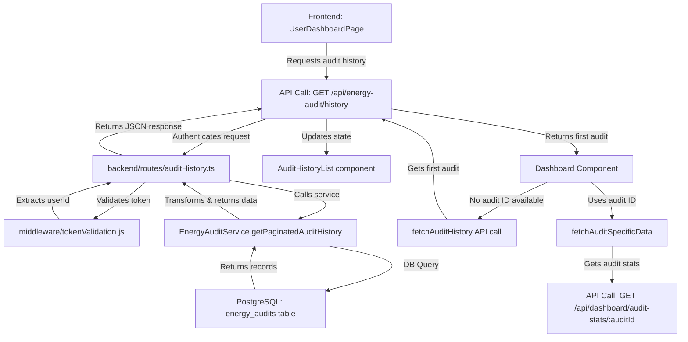
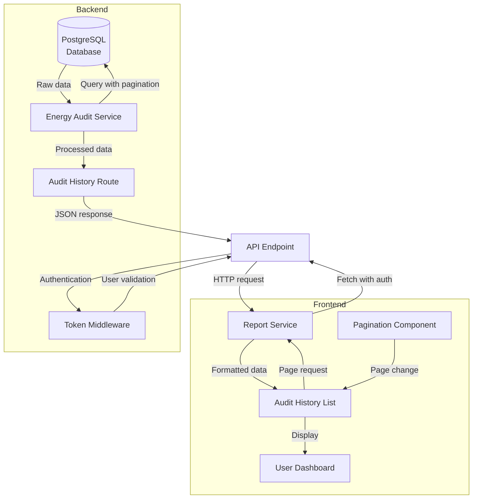
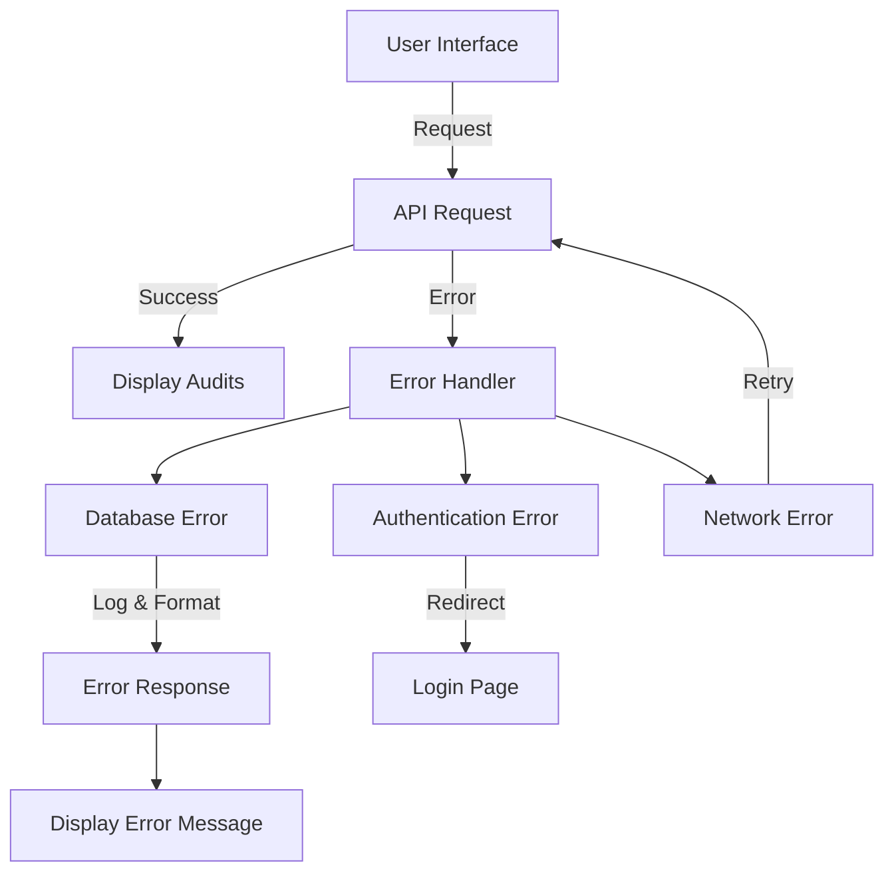
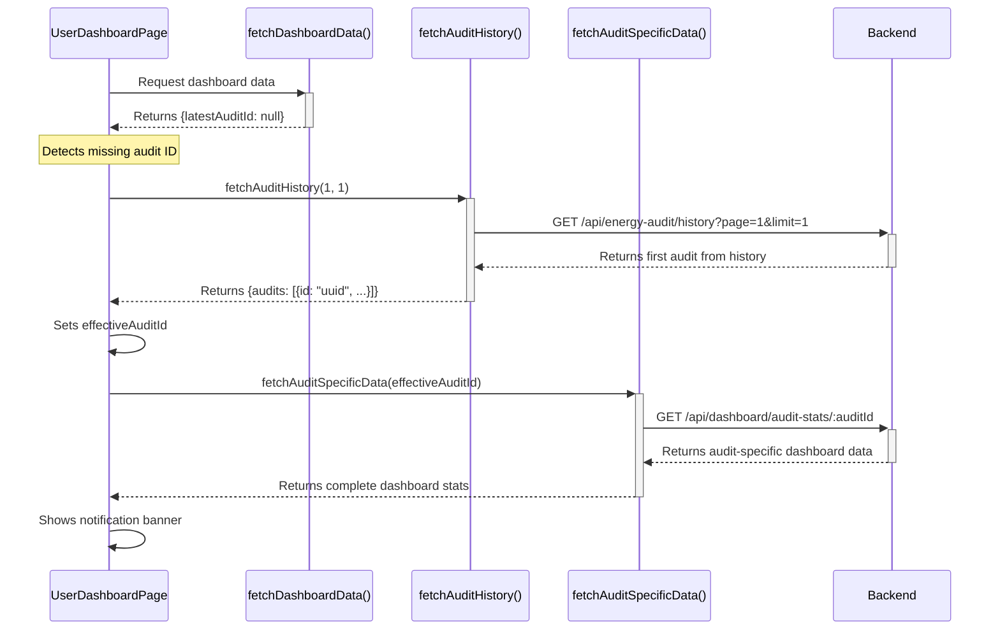

# Audit History Data Flow

## Overview
This document outlines the complete data flow for the audit history feature, which allows users to view their past energy audits with pagination support. The flow spans from the database to the user interface, involving multiple components across both backend and frontend systems.

## System Flow Overview



## Architectural Flow Diagram



## Step-by-Step Flow

1. **User Request Initiation**
   - User navigates to the dashboard page
   - UserDashboardPage component mounts
   - ReportsTab component is selected or dashboard loads with empty audit ID
   - AuditHistoryList component triggers data fetch

2. **Frontend API Request**
   - ReportService calls `fetchAuditHistory(page, limit)`
   - `fetchWithAuth` utility adds auth tokens from cookies or headers
   - API request is sent to `/api/energy-audit/history?page=1&limit=5`

3. **Backend Route Handling**
   - Server routes the request to auditHistoryRoutes
   - Request is authenticated via validateToken middleware
   - User ID is extracted from authentication token
   - Pagination parameters are parsed and validated

4. **Data Service Processing**
   - EnergyAuditService.getPaginatedAuditHistory is called
   - Database connection is acquired from pool
   - Total record count query is executed
   - Main paginated query is executed with defensive SQL
   - Raw data is processed and transformed
   - Connection is released back to pool

5. **Response Construction**
   - Query results are formatted into standardized structure
   - Pagination metadata is calculated (totalPages, etc.)
   - Complete response object is constructed
   - JSON response is sent back to client

6. **Frontend Rendering**
   - Report service processes the response
   - AuditHistoryList receives the data
   - Pagination component is updated with page info
   - Audit items are rendered in the UI

7. **User Interaction**
   - User can click pagination controls
   - Page change triggers a new request
   - Steps 2-6 repeat with new page parameter

## Error Handling Flow



Error handling occurs at multiple levels:

1. **Database Level**
   - SQL errors are caught and logged
   - Database connections are properly released
   - Custom error types provide context

2. **Service Level**
   - Input validation prevents invalid queries
   - Default values ensure consistent responses
   - Error messages are sanitized and standardized

3. **API Level**
   - HTTP status codes indicate error types
   - Detailed error messages aid debugging
   - Authentication failures redirect to login

4. **Frontend Level**
   - Network errors trigger retry logic
   - Error states display user-friendly messages
   - Fallback UI prevents blank screens

## Data Structure Transformations

### Database → Service
From:
```sql
-- Raw database rows
{
  id: "uuid",
  created_at: "timestamp",
  basic_info: {"address": "123 Main St", ...},
  ...
}
```

To:
```typescript
// Processed service data
{
  id: "uuid",
  date: "ISO string",
  address: "123 Main St",
  recommendations: 5,
  title: "March Energy Audit",
  status: "completed"
}
```

### Service → API
From:
```typescript
// Internal service result
{
  audits: [...],
  pagination: {
    totalRecords: 44,
    totalPages: 9,
    currentPage: 1,
    limit: 5
  }
}
```

To:
```json
// API JSON response
{
  "audits": [...],
  "pagination": {
    "totalRecords": 44,
    "totalPages": 9,
    "currentPage": 1,
    "limit": 5
  }
}
```

### API → Frontend
From:
```json
// API JSON response
{
  "audits": [...],
  "pagination": {...}
}
```

To:
```typescript
// React component props
{
  audits: [...],
  pagination: {...},
  onPageChange: (page) => void,
  isLoading: boolean,
  error: string | null
}
```

## Dashboard Auto-Loading Flow

The audit history data is also used as a fallback mechanism for the dashboard when no valid audit ID is available:



This flow ensures users always see meaningful dashboard data, even when the initial dashboard response doesn't include a valid audit ID. The system intelligently falls back to the user's most recent audit from history and uses it to populate the dashboard statistics.

## Related Components
- Backend: [[audit_history_routes]]
- Backend: [[audit_history_service]]
- Backend: [[dashboard_routes]]
- Frontend: [[AuditHistoryList]]
- Frontend: [[reportService]]
- Frontend: [[Pagination]]
- Frontend: [[user_dashboard_page]]
- Frontend: [[auto_loading_latest_audit]]
- Database: `energy_audits` and `audit_recommendations` tables

## Known Issues and Solutions

| Issue | Symptom | Solution |
|-------|---------|----------|
| Null address data | 500 errors when accessing history | COALESCE in SQL query |
| JSON parsing errors | Failed to parse address fields | Multi-level fallbacks |
| Request timeouts | Slow loading on large datasets | Pagination with reasonable limits |
| Missing recommendations | Recommendation count shows 0 | Defensive subquery with COALESCE |
| Authentication failures | 401 errors | Improved token validation and refresh |
| Date formatting issues | Inconsistent date display | Standardized ISO format from backend |
| Empty dashboard data | Empty charts and zero values | Auto-loading fallback with audit history |
| Invalid audit IDs | Dashboard shows "null" or "undefined" IDs | String value detection and replacement |
