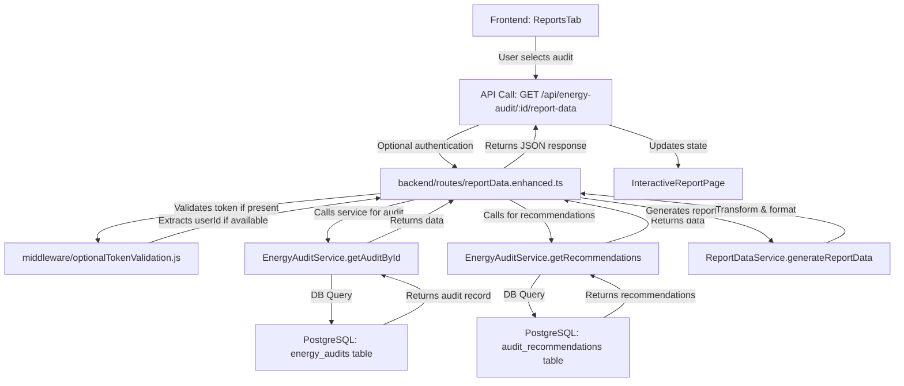
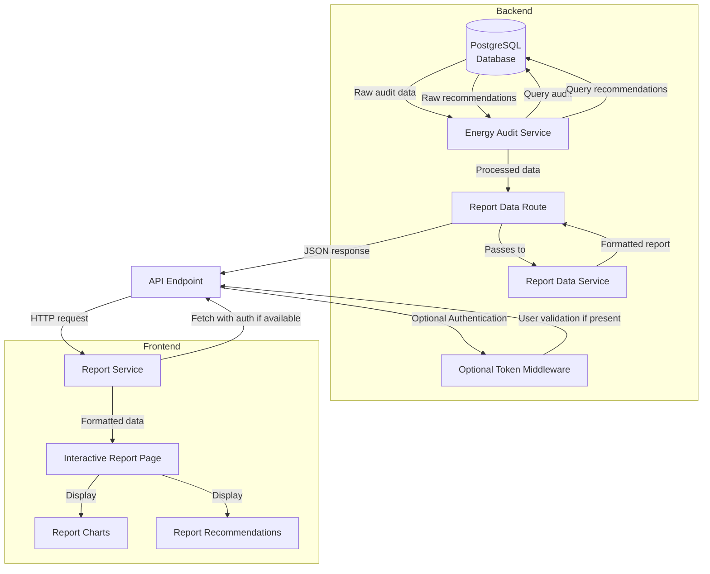
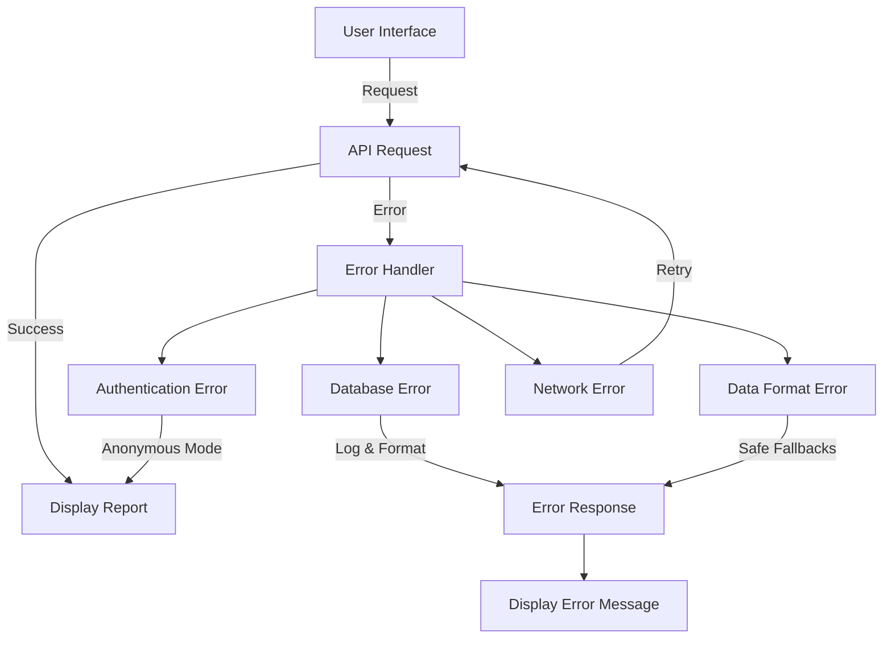
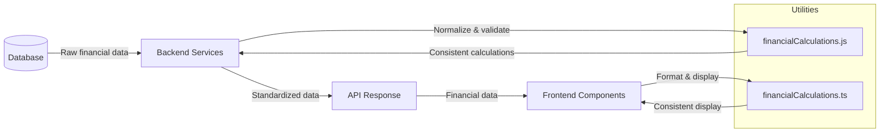

# Report Data Flow

## Overview
This document outlines the complete data flow for the report data feature, which allows users to view detailed reports based on their energy audits. The flow spans from the database to the interactive report interface, involving multiple components across both backend and frontend systems.

## System Flow Overview



## Architectural Flow Diagram



## Step-by-Step Flow

1. **User Request Initiation**
   - User navigates to the dashboard page
   - User selects an audit from the AuditHistoryList
   - ReportsTab triggers data fetch for the selected audit
   - Report data is requested for detailed view

2. **Frontend API Request**
   - ReportService calls `fetchReportData(auditId)`
   - `fetchWithAuth` utility adds auth tokens if available
   - API request is sent to `/api/energy-audit/${auditId}/report-data`

3. **Backend Route Handling**
   - Server routes the request to reportDataRoutes via Express route pattern
   - Request passes through optionalTokenValidation middleware
   - Audit ID is extracted from route parameters
   - ID is validated for UUID format and existence

4. **Data Service Processing**
   - EnergyAuditService.getAuditById is called to retrieve audit data
   - EnergyAuditService.getRecommendations is called to get recommendations
   - ReportDataService.generateReportData processes both datasets
   - Data is transformed into a standardized report format
   - JSON response is prepared with robust error handling

5. **Response Construction**
   - Safe parsing handles inconsistent data formats
   - Default values ensure complete report structure
   - Detailed error messages capture processing issues
   - Recommendations are linked to audit data points
   - Complete response object is constructed with necessary fields

6. **Frontend Rendering**
   - Report service processes the response
   - InteractiveReportPage receives the data
   - ReportCharts component visualizes energy data
   - RecommendationsList shows actionable items
   - Financial calculations are displayed

7. **User Interaction**
   - User can interact with visualizations
   - Recommendation details can be expanded
   - Filtering and sorting options are available

## Error Handling Flow



Error handling occurs at multiple levels:

1. **Database Level**
   - SQL errors are caught and logged
   - Specific error types indicate database issues
   - Null or missing data is handled gracefully

2. **Service Level**
   - JSON parsing is wrapped in try/catch
   - Default values are provided for missing fields
   - Type conversion ensures consistent data formats
   - Field validation prevents downstream errors

3. **API Level**
   - Enhanced error handling provides context
   - Detailed logging aids debugging
   - Status codes indicate error types
   - Optional authentication prevents unnecessary 401s

4. **Frontend Level**
   - Loading states show progress
   - Error boundaries prevent UI crashes
   - Fallback UI ensures usable interface
   - Retry logic handles temporary network issues

## Financial Data Consistency

The system ensures financial data consistency through dedicated utilities in both frontend and backend:



Financial calculations are standardized using utilities that maintain consistency in several key areas:

1. **Recommendation Costs**: Prioritizing implementation cost with fallback to estimated cost
2. **Savings Validation**: Validating and normalizing savings values to prevent NaN/undefined
3. **Aggregation Functions**: Standardized calculations for totals across recommendations
4. **Formatting Functions**: Consistent currency and percentage formatting

These utilities solve previous issues with inconsistent financial data display and calculation methods.

## Data Structure Transformations

### Database → Service
From:
```sql
-- Raw database rows
{
  id: "uuid",
  user_id: "uuid",
  basic_info: {"address": "123 Main St", ...},
  home_details: {...},
  current_conditions: {...},
  heating_cooling: {...},
  energy_consumption: {...},
  created_at: "timestamp"
}

-- Recommendations table
[
  {
    id: "uuid",
    audit_id: "uuid",
    type: "insulation",
    details: {...},
    savings: {...},
    priority: "high",
    created_at: "timestamp"
  },
  ...
]
```

To:
```typescript
// Processed report data
{
  auditId: "uuid",
  address: "123 Main St",
  createdAt: "ISO string",
  homeStats: {
    size: 2500,
    yearBuilt: 1985,
    ...
  },
  energyUsage: {
    current: {...},
    projected: {...},
    savings: {...}
  },
  recommendations: [
    {
      id: "uuid",
      type: "insulation",
      title: "Improve attic insulation",
      description: "...",
      savingsAmount: 350,
      savingsPercentage: 15,
      implementationCost: "$$",
      priority: "high"
    },
    ...
  ],
  charts: {
    usage: {...},
    comparison: {...},
    savings: {...}
  }
}
```

## URL Pattern Requirements

The frontend expects report data to be available at a specific URL pattern:

```
/api/energy-audit/:id/report-data
```

This pattern must be maintained to ensure compatibility with the frontend components. The route registration in `server.ts` must place this specialized route before the general energy audit routes to prevent routing conflicts.

## Related Components
- Backend: [[report_data_routes]]
- Backend: [[report_data_service]]
- Backend: [[energy_audit_service]]
- Frontend: [[InteractiveReportPage]]
- Frontend: [[ReportCharts]]
- Frontend: [[ReportService]]
- Frontend: [[financial_calculations]]
- Backend: [[utils/financialCalculations.js]]
- Database: `energy_audits` and `audit_recommendations` tables

## Known Issues and Solutions

| Issue | Symptom | Solution |
|-------|---------|----------|
| Route conflict | 500 errors for `/api/energy-audit/:id/report-data` | Register specialized route with matching URL pattern before general routes |
| JSON parsing errors | Failed to process audit data fields | Safe parsing with fallbacks in ReportDataService |
| Missing recommendation data | Blank sections in report | Default empty arrays and defensive programming |
| Inconsistent field names | 500 errors from missing properties | Normalize field names in ReportDataService |
| Authentication issues for public reports | 401 errors for shareable reports | Optional token validation middleware |
| Field type mismatches | NaN errors in calculations | Type conversion and validation in service layer |
| Product preference discrepancy | Field name mismatch | Handle both `productPreferences` and `product_preferences` |
