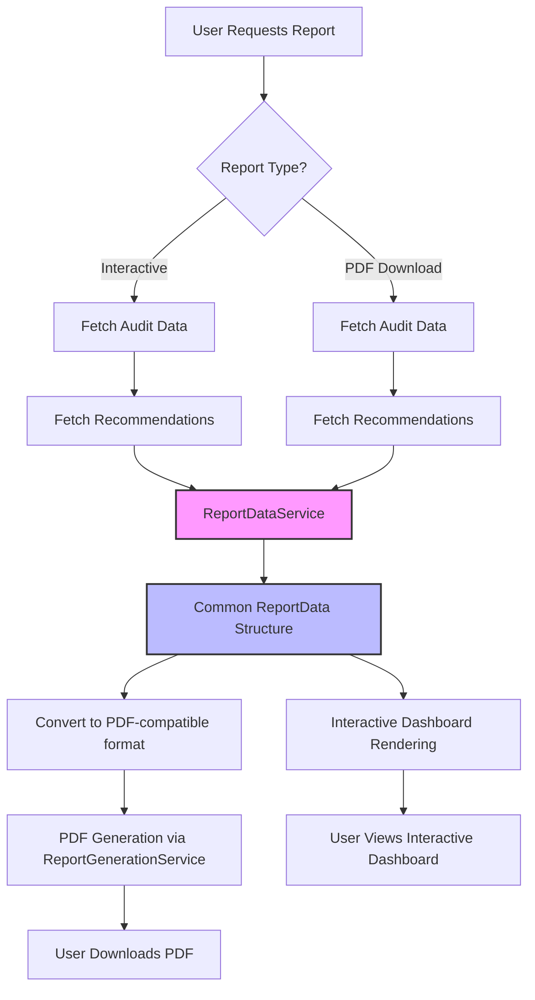

# Report Data Flow

## Overview

This document describes the data flow for generating both interactive dashboard reports and PDF reports for energy audits. The system is designed to ensure consistency between both formats while adapting to their specific rendering requirements.

## Data Flow Diagram



## Common Data Processing

The system employs a unified data flow to ensure consistency between the interactive dashboard and the downloadable PDF reports:

1. **Data Acquisition**:
   - Audit data is fetched from the database
   - Recommendations are retrieved for the specific audit

2. **Data Normalization** (ReportDataService):
   - Parses and validates input data structures
   - Applies consistent defaults for missing fields
   - Normalizes field names from snake_case to camelCase
   - Handles nested data structures
   - Performs financial calculations consistently
   - Generates a standardized `ReportData` structure

3. **Report Type Specific Processing**:
   - **Interactive Dashboard**: 
     - Uses the ReportData structure directly for React component rendering
   - **PDF Report**: 
     - Converts ReportData to EnergyAuditData format for compatibility with PDF generator
     - Uses the same calculation methods for metrics and charts

## Key Components

### ReportDataService

The centralized service responsible for transforming raw audit data into a consistent format for both report types. It performs:

- JSON parsing and validation
- Field normalization
- Default value application
- Data structure mapping
- Validation of critical fields

### ReportGenerationService

Handles the PDF generation using the standardized data format. It:

- Creates the PDF document structure
- Generates charts and visualizations
- Formats the document sections
- Creates tables and text content

## Financial Calculations

A critical aspect of consistency is the way financial data is calculated. Both report types use:

- The same financial calculation utility functions
- Consistent formatting for currency, percentages, and numbers
- Identical methods for estimating potential savings
- Shared logic for calculating payback periods

## Error Handling

Both data flow paths include:

- Validation of input data
- Default values for missing fields
- Detailed error logging
- User-friendly error messages
- Graceful degradation when specific data is unavailable

## Data Formats

### ReportData (Common Format)

```typescript
interface ReportData {
  metadata: {
    reportId: string;
    reportDate: string;
    version: string;
  };
  executiveSummary: {
    totalEnergy: number;
    efficiencyScore: number;
    energyEfficiency: number;
    potentialSavings: number;
  };
  propertyInfo: {
    address: string;
    propertyType: string;
    yearBuilt: number;
    squareFootage: number;
  };
  // Additional fields...
}
```

### Format Conversion for PDF Generation

```typescript
// Convert standardized ReportData to EnergyAuditData for PDF generator
const transformedAudit: EnergyAuditData = {
  basicInfo: {
    fullName: 'Anonymous User',
    email: 'anonymous@example.com',
    phone: '555-555-5555',
    auditDate: new Date().toISOString().split('T')[0],
    occupants: 2,
    ...reportData.propertyInfo,
    propertyType: reportData.propertyInfo.propertyType || 'single-family'
  },
  // Additional mapping...
};
```

## Troubleshooting

Common issues and their solutions:

1. **Inconsistent Values**: Ensure both routes are using ReportDataService without any custom overrides
2. **Missing Fields**: Check default values in ReportDataService
3. **PDF Rendering Issues**: Verify transformedAudit structure matches PDF generator requirements
4. **Financial Calculation Differences**: Confirm shared utility functions

## Related Documentation

- [[frontend/components/reports/pdf_report_generation]]
- [[backend/services/report_generation_service]]
- [[frontend/components/reports/report_charts]]
- [[frontend/components/reports/enhanced_report_recommendations]]
- [[frontend/utils/financial_calculations]]
