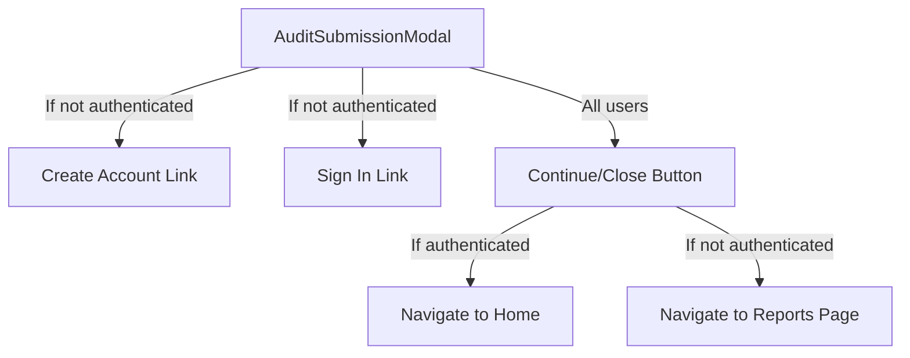

## Overview

The `AuditSubmissionModal` is displayed after a user successfully submits an energy audit. It provides options for different user flows depending on authentication status.

## Key Features

- Success confirmation message
- Options for authenticated and non-authenticated users
- Redirects guest users to audit report page
- Provides options to create account or sign in for non-authenticated users
- Displays the audit ID for reference

## Props/Interfaces

```typescript
interface AuditSubmissionModalProps {
  isOpen: boolean;
  onClose: () => void;
  auditId: string;
  isAuthenticated: boolean;
}
```

## Component Structure



## Dependencies/Imports

- React
- react-router-dom (Link)

## Implementation Details

The modal provides three main paths for users:

1. For authenticated users:
   - A simple close button that returns them to the home page

2. For non-authenticated users:
   - **Create Account**: Links to sign-up page with the audit ID included as a URL parameter
   - **Sign In**: Links to sign-in page with the audit ID included as a URL parameter
   - **Continue as Guest**: Redirects to the reports page with the audit ID (`/reports/{auditId}`)

### Guest User Flow

When a non-authenticated user clicks "Continue as Guest", they are redirected to:
```
https://energy-audit-store-e66479ed4f2b.herokuapp.com/reports/{auditId}
```

This functionality is implemented in the parent component (`EnergyAuditForm.tsx`) in the `handleModalClose` function.

## Related Files

- [[EnergyAuditForm]]
- [[InteractiveReportPage]]

## Notes/To-Do

- The component uses a simple conditional rendering pattern (`if (!isOpen) return null`) for showing/hiding
- Guest users are shown their audit ID to save for future reference
