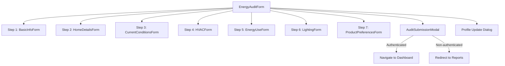

## Overview

The `EnergyAuditForm` is the central component for collecting energy audit information. It implements a multi-step form process that guides users through various categories of information needed for an energy audit. After submission, it handles different user flows for authenticated and non-authenticated users.

## Key Features

- Multi-step form with validation
- Auto-fill capabilities from user profile and previous audits
- Mobile home and property-type specific defaults
- Form state persistence with localStorage
- Submission handling for both authenticated and guest users
- Analytics tracking throughout the form process
- Profile update options for authenticated users

## Component Structure



## Dependencies/Imports

- React and React hooks
- React Router Dom (useNavigate)
- API and Auth contexts
- Analytics tracking hooks
- Form subcomponents for each step
- Dialog and modal components
- Utility functions for data handling

## Implementation Details

### Form Steps

1. Basic Info: Contact information and property type
2. Home Details: Property characteristics and dimensions
3. Current Conditions: Insulation, windows, doors, and comfort issues
4. HVAC: Heating and cooling systems information
5. Energy Use: Consumption patterns and bills
6. Lighting: Lighting types and usage
7. Product Preferences: Categories of interest and budget constraints

### Post-Submission Logic

After successful submission, the component:

1. For authenticated users:
   - Shows a profile update dialog if relevant fields were modified
   - Allows selective updates to user profile
   - Navigates to dashboard with the new audit ID

2. For non-authenticated (guest) users:
   - Shows the AuditSubmissionModal with sign-up/sign-in options
   - When "Continue as Guest" is clicked, redirects to the reports page with the audit ID
   - The `handleModalClose` function redirects to: `https://energy-audit-store-e66479ed4f2b.herokuapp.com/reports/{auditId}`

### Recent Changes

The guest user flow has been updated to automatically redirect users to their audit report page when they click "Continue as Guest", rather than just closing the modal and returning to the home page.

```typescript
const handleModalClose = () => {
  // Track modal close action
  trackSubmission('modal_close', {});
  
  setShowSubmissionModal(false);
  clearStoredAuditData();
  
  if (!isAuthenticated && submittedAuditId) {
    // For guest users, redirect to the reports page with the audit ID
    window.location.href = `https://energy-audit-store-e66479ed4f2b.herokuapp.com/reports/${submittedAuditId}`;
  } else {
    // For authenticated users, navigate to home
    navigate('/');
  }
};
```

## Related Files

- [[AuditSubmissionModal]]
- [[InteractiveReportPage]]
- [[FormProgressIndicator]]
- [[FormErrorDisplay]]

## Related Data Flows

- [[audit-submission-guest-flow]]

## Notes/To-Do

- The component uses extensive analytics tracking for user interactions
- Form validation is performed at each step and again before final submission
- Default values are provided for required fields to prevent validation errors
- Mobile-specific defaults are applied when the property type is set to mobile home
