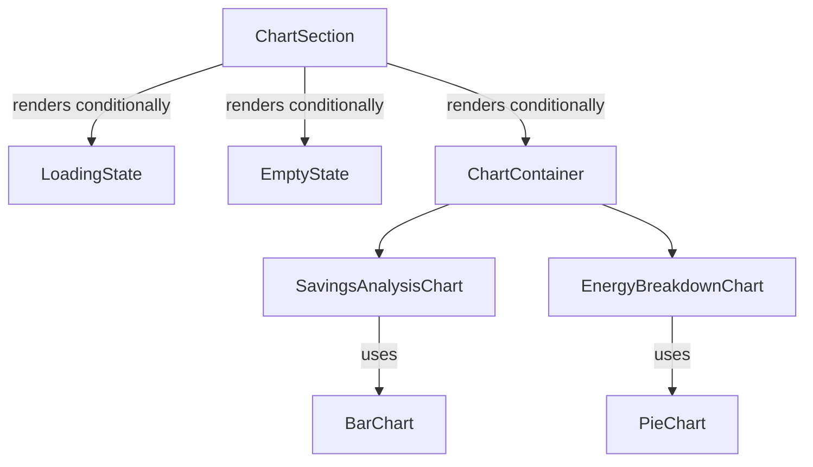

# ChartSection

## Overview
The ChartSection component is responsible for rendering visualizations of energy data on the dashboard. It uses the Recharts library to create interactive and responsive charts that display various aspects of energy usage and savings.

## Key Features
- Displays energy breakdown in a pie chart format
- Shows savings analysis using a bar chart with estimated vs. actual savings
- Includes loading state visualization
- Handles empty data states appropriately

## Props/Interfaces
```typescript
interface ChartDataPoint {
  name: string;
  value: number;
}

interface SavingsChartDataPoint {
  name: string;
  estimatedSavings: number;
  actualSavings: number;
}

interface ChartSectionProps {
  energyBreakdown?: ChartDataPoint[];
  consumption?: ChartDataPoint[];
  savingsAnalysis?: SavingsChartDataPoint[];
  isLoading?: boolean;
}
```

## Component Structure



## Dependencies/Imports
- React
- Recharts components:
  - BarChart, Bar, XAxis, YAxis, CartesianGrid
  - Tooltip, Legend, ResponsiveContainer
  - PieChart, Pie, Cell, Label

## Implementation Details
The component handles three main states:
1. **Loading state**: Shows a spinning animation
2. **Empty state**: Displays a message when no data is available
3. **Data visualization state**: Renders charts based on available data

Chart configurations include:
- Custom currency formatting for financial values
- Percentage formatting for pie chart segments
- Color theming that matches the application design system
- Responsive container sizing for different viewports

## Related Files
- [[SimpleDashboardLayout]] - Parent component that includes ChartSection
- [[DashboardDataMergeUtility]] - Utility that prepares data for the charts
- [[DashboardEnergyAnalysis]] - Previous version of similar functionality

## Notes
- The pie chart uses a donut-style representation for energy breakdown
- Financial data is formatted using the Intl.NumberFormat for localization
- The component conditionally renders each chart section based on data availability
