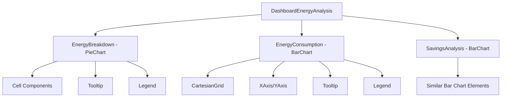

# DashboardEnergyAnalysis

## Overview

The `DashboardEnergyAnalysis` component provides interactive visual representations of the user's energy data through a series of charts. It helps users understand their energy consumption patterns, breakdown by category, and analyze savings.

## Key Features

- Energy breakdown visualization with pie chart
- Energy consumption factors visualization with bar chart
- Savings analysis visualization comparing estimated vs. actual savings
- Responsive design that adapts to different screen sizes
- Loading state and fallback for missing data
- Percentage calculations for easy understanding

## Component Structure



## Props/Interfaces

```typescript
interface EnergyAnalysisProps {
  data: {
    energyBreakdown: ChartDataPoint[];
    consumption: ChartDataPoint[];
    savingsAnalysis: SavingsChartDataPoint[];
  };
  isLoading?: boolean;
}

interface ChartDataPoint {
  name: string;
  value: number;
}

interface SavingsChartDataPoint {
  name: string;
  estimatedSavings: number;
  actualSavings: number;
}
```

## Dependencies/Imports

- React for component structure
- Recharts for chart visualizations (PieChart, BarChart, LineChart, etc.)
- Utility functions for financial calculations and formatting
- Responsive hooks for mobile adaptations

## Implementation Details

The component employs several techniques to provide effective visualizations:

1. **Responsive Design**: 
   - Uses media queries to detect mobile devices
   - Adjusts chart dimensions, font sizes, and legends based on screen size
   - Ensures proper visualization on all devices

2. **Data Processing**:
   - Calculates percentages for the pie chart
   - Formats data points for proper display
   - Handles missing or incomplete data gracefully

3. **Visual Enhancements**:
   - Custom color palette for consistent branding
   - Tooltips for detailed information on hover
   - Legends for clear category identification

4. **Error Handling**:
   - Displays loading state during data fetching
   - Shows fallback message when data is unavailable
   - Validates data structure before rendering

## Related Files

- [[UserDashboardPage]] - Parent page containing this component
- [[DashboardOverview]] - Parent component that renders this component
- [[EnhancedDashboardRecommendations]] - Complementary component for recommendations

## Technical Decisions

1. **Chart Type Selection**:
   - Pie chart for energy breakdown to show proportional distribution
   - Bar charts for consumption and savings to allow easy comparison
   - Custom styling for improved readability

2. **Conditional Rendering**:
   - Shows loading indicator during data fetching
   - Provides fallback UI when data is missing or malformed
   - Adapts layout based on available data

3. **Mobile Optimizations**:
   - Simplifies labels on small screens
   - Adjusts chart dimensions for better mobile viewing
   - Modifies tooltip and legend positioning for touch interfaces

## Usage Example

```tsx
// Inside parent component
const energyAnalysisData = {
  energyBreakdown: [
    { name: 'Heating', value: 320 },
    { name: 'Cooling', value: 230 },
    { name: 'Lighting', value: 150 },
    { name: 'Appliances', value: 200 }
  ],
  consumption: [
    { name: 'Jan', value: 420 },
    { name: 'Feb', value: 380 },
    // more months...
  ],
  savingsAnalysis: [
    { name: 'Heating', estimatedSavings: 120, actualSavings: 85 },
    { name: 'Lighting', estimatedSavings: 75, actualSavings: 80 },
    // more categories...
  ]
};

<DashboardEnergyAnalysis 
  data={energyAnalysisData} 
  isLoading={false} 
/>
```

## Notes/To-Do

- Consider adding download/export functionality for chart data
- Add customization options for time periods (monthly, quarterly, yearly)
- Implement trend analysis for consumption patterns
- Add comparison to industry benchmarks or similar households
