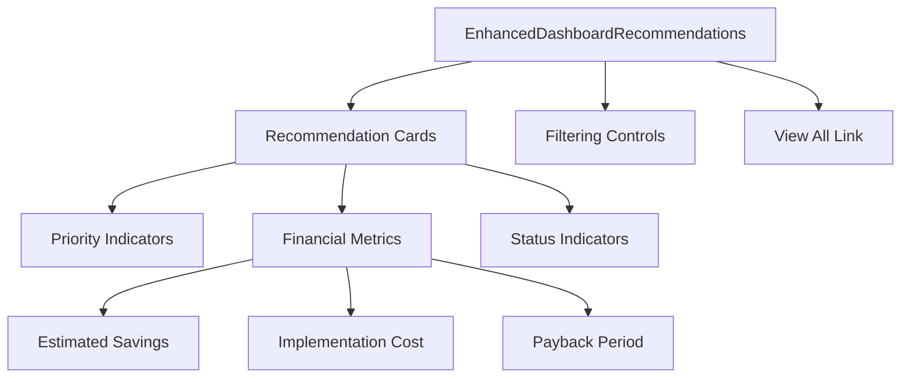

# EnhancedDashboardRecommendations

## Overview

The `EnhancedDashboardRecommendations` component provides a streamlined and user-friendly interface for displaying energy-saving recommendations. It features user preference-based filtering, visual priority indicators, and detailed financial metrics for each recommendation.

## Key Features

- User preference-based filtering of recommendations
- Priority-based sorting and visual indicators
- Detailed financial metrics (savings, costs, payback period)
- Direct link to view full recommendation details in interactive report
- Responsive design for all device sizes
- Limited preview with option to view all recommendations

## Component Structure



## Props/Interfaces

```typescript
interface EnhancedDashboardRecommendationsProps {
  recommendations: AuditRecommendation[];
  userCategories?: string[];
  budgetConstraint?: number;
  auditId?: string | null;
  isLoading?: boolean;
  onRefresh?: () => void;
}

// AuditRecommendation interface from types/energyAudit.ts
interface AuditRecommendation {
  id: string;
  title: string;
  description: string;
  type: string;
  priority: 'high' | 'medium' | 'low';
  status: 'active' | 'implemented';
  estimatedSavings: number;
  actualSavings: number | null;
  implementationDate: string | null;
  implementationCost: number | null;
  estimatedCost: number;
  paybackPeriod: number;
  lastUpdate: string;
}
```

## Dependencies/Imports

- React hooks for state management and effects
- React Router for navigation to detailed reports
- Lucide React for iconography
- Utility functions for financial calculations and formatting

## Implementation Details

The component employs several techniques to provide an effective recommendation experience:

1. **User Preference Filtering**: 
   - Filters recommendations based on user-selected categories
   - Toggle between all recommendations and user-preferred categories
   - Retains state of filter preference

2. **Recommendation Sorting**:
   - Sorts recommendations by priority (high, medium, low)
   - Displays high-priority recommendations first
   - Limits preview to 3 recommendations with count of total available

3. **Visual Enhancements**:
   - Color-coded priority indicators (red for high, yellow for medium, green for low)
   - Icons for better visual scanning
   - Card-based layout with hover effects

4. **Financial Context**:
   - Clear presentation of savings, costs, and payback period
   - Consistent formatting of currency values
   - Visual separation of financial metrics

## Related Files

- [[UserDashboardPage]] - Parent page containing this component
- [[DashboardOverview]] - Parent component that renders this component
- [[DashboardEnergyAnalysis]] - Complementary component for energy visualizations

## Technical Decisions

1. **Preview Limitation**:
   - Shows only the top 3 recommendations to avoid overwhelming users
   - Includes a clear count of how many more recommendations are available
   - Provides a prominent button to view all recommendations in the interactive report

2. **Preference-Based Filtering**:
   - Allows users to toggle between all recommendations and those matching their preferences
   - Preserves filter state during dashboard session
   - Shows empty state with option to view all when filtered results are empty

3. **Financial Emphasis**:
   - Highlights estimated savings and payback period
   - Uses color psychology (green for savings)
   - Provides clear metrics in easily scannable format

## Usage Example

```tsx
// Inside parent component
const recommendations = [
  {
    id: "rec123",
    title: "HVAC System Upgrade Required",
    description: "Current system operating below optimal efficiency",
    type: "hvac",
    priority: "high",
    status: "active",
    estimatedSavings: 520,
    actualSavings: null,
    implementationDate: null,
    implementationCost: null,
    estimatedCost: 3850,
    paybackPeriod: 7.3,
    lastUpdate: "2025-03-15T14:30:00Z"
  },
  // More recommendations...
];

const userCategories = ["hvac", "lighting", "insulation"];

<EnhancedDashboardRecommendations 
  recommendations={recommendations}
  userCategories={userCategories}
  budgetConstraint={5000}
  auditId="audit-123"
  isLoading={false}
  onRefresh={() => fetchLatestData()}
/>
```

## Notes/To-Do

- Consider adding ability to mark recommendations as favorites
- Implement notification system for high-ROI recommendations
- Add sorting options (by savings, by cost, by ROI)
- Provide comparison view between multiple recommendations
- Implement progress tracking for recommendation implementation
