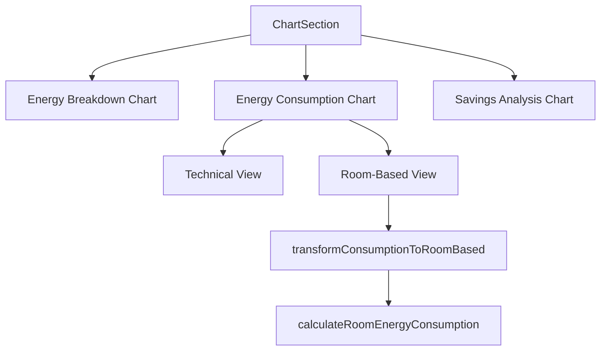

# ChartSection Component

## Overview

The `ChartSection` component displays energy data visualizations in the user dashboard. It provides users with intuitive insights into their energy consumption patterns through various chart types. The component has been enhanced with room-based energy consumption visualization to make the data more relatable and actionable for users.

## Key Features

- **Energy Breakdown Chart**: Pie chart showing the distribution of energy usage across categories (HVAC, lighting, etc.)
- **Energy Consumption Factors Chart**: Bar chart showing energy consumption factors with enhanced user-friendly features:
  - **Technical/Room-Based Toggle**: Switch between abstract categories and intuitive room categories
  - **Monthly/Annual Toggle**: Switch between monthly and annual consumption views
  - **Unit Conversion**: Automatic conversion to MWh for large values (>1000 kWh)
  - **Contextual Tooltips**: Relatable comparisons (e.g., "equivalent to running 10 LED TVs for 4 hours daily")
- **Savings Analysis Chart**: Bar chart comparing estimated vs. actual savings

## Props/Interfaces

```typescript
interface ChartSectionProps {
  energyBreakdown?: ChartDataPoint[];      // Data for the energy breakdown pie chart
  consumption?: ChartDataPoint[];          // Data for the abstract consumption factors
  savingsAnalysis?: SavingsChartDataPoint[]; // Data for the savings analysis chart
  isLoading?: boolean;                     // Whether data is currently loading
  auditData?: any;                         // Raw audit data for room-based calculations
}

interface ChartDataPoint {
  name: string;   // Category name
  value: number;  // Value (typically kWh)
}

interface SavingsChartDataPoint {
  name: string;             // Category name
  estimatedSavings: number; // Estimated financial savings amount
  actualSavings: number;    // Actual financial savings amount
}
```

## Component Structure



## Dependencies/Imports

The component relies on the following dependencies:

- **recharts**: For all chart visualizations (Bar, Pie, etc.)
- **energyBreakdownCalculations.ts**: For transforming abstract consumption data to room-based data
  - `transformConsumptionToRoomBased`: Maps abstract energy categories to room-based categories
  - `calculateRoomEnergyConsumption`: Calculates energy values for each room type

## Implementation Details

### User-Friendly Energy Visualization

The component offers several features to make energy consumption data more intuitive and actionable:

1. **Room-Based Visualization**:
   - Uses the `auditData` prop with the `transformConsumptionToRoomBased` utility
   - Maintains a `showRoomBased` state to toggle between abstract and room-based views
   - Applies room-specific colors to each bar in the chart

2. **Time Period Normalization**:
   - Uses a `showMonthly` state to toggle between monthly and annual views
   - Divides annual values by 12 for monthly view to show more relatable numbers
   - Updates axis labels and tooltips to indicate the appropriate time period unit

3. **Unit Conversion**:
   - Automatically converts large energy values (>1000 kWh) to MWh
   - Uses the `formatEnergyValue` function to apply the appropriate unit based on value size
   - Simplifies large numbers to make them more comprehensible (e.g., "1.5 MWh" instead of "1500 kWh")

4. **Contextual Tooltips**:
   - Provides room descriptions that explain what each category includes
   - Adds relatable real-world comparisons based on the energy consumption value
   - Adjusts comparisons depending on whether viewing monthly or annual data

### Color Coding

Room types have consistent color coding:
- Living Room: Blue (#4287f5)
- Kitchen: Amber (#f5a742)
- Bedrooms: Light Blue (#42c5f5)
- Bathroom: Purple (#8e42f5)
- Outdoor: Green (#42f575)

### Toggle Mechanisms

The component provides two intuitive toggles for customizing the view:

1. **View Type Toggle**:
   - Switch between technical and room-based categories
   - Button appears only when both data types are available
   - Default view is room-based for better user understanding

2. **Time Period Toggle**:
   - Switch between monthly and annual energy consumption
   - Uses icon indicators (Calendar for annual, Clock for monthly)
   - Refreshes all chart elements including tooltips, axis labels, and values

## Related Files

- `src/utils/energyBreakdownCalculations.ts`: Contains utility functions for energy calculations
- `docs/room-based-energy-mapping.md`: Detailed documentation on the methodology used for room-based mapping
- `src/pages/NewUserDashboardPage.tsx`: Parent component that provides the auditData prop

## Notes/To-Do

- Consider adding more granular room categories in the future (e.g., separating primary bedroom from other bedrooms)
- Explore adding timeline charts to show energy usage patterns by room over time
- Add ability to drill down into each room for more detailed energy usage breakdown
