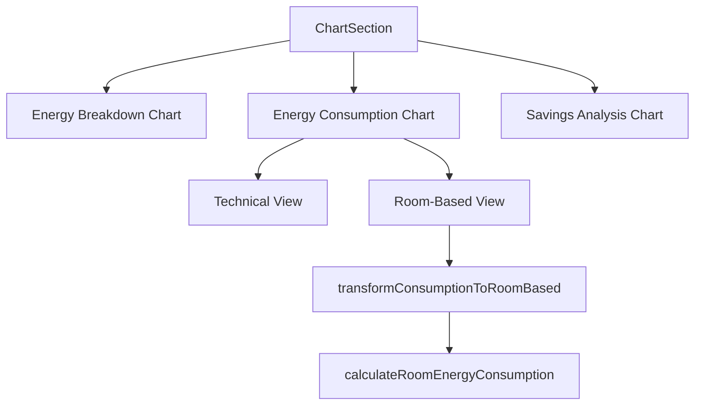

# ChartSection Component

## Overview

The `ChartSection` component displays energy data visualizations in the user dashboard. It provides users with intuitive insights into their energy consumption patterns through various chart types. The component has been enhanced with room-based energy consumption visualization to make the data more relatable and actionable for users.

## Key Features

- **Energy Breakdown Chart**: Pie chart showing the distribution of energy usage across categories (HVAC, lighting, etc.)
- **Energy Consumption Factors Chart**: Bar chart showing energy consumption factors with toggleable views:
  - **Technical View**: Abstract categories (Base, Seasonal, Occupied, Real)
  - **Room-Based View**: Intuitive room categories (Living Room, Kitchen, Bedrooms, Bathroom, Outdoor)
- **Savings Analysis Chart**: Bar chart comparing estimated vs. actual savings

## Props/Interfaces

```typescript
interface ChartSectionProps {
  energyBreakdown?: ChartDataPoint[];      // Data for the energy breakdown pie chart
  consumption?: ChartDataPoint[];          // Data for the abstract consumption factors
  savingsAnalysis?: SavingsChartDataPoint[]; // Data for the savings analysis chart
  isLoading?: boolean;                     // Whether data is currently loading
  auditData?: any;                         // Raw audit data for room-based calculations
}

interface ChartDataPoint {
  name: string;   // Category name
  value: number;  // Value (typically kWh)
}

interface SavingsChartDataPoint {
  name: string;             // Category name
  estimatedSavings: number; // Estimated financial savings amount
  actualSavings: number;    // Actual financial savings amount
}
```

## Component Structure



## Dependencies/Imports

The component relies on the following dependencies:

- **recharts**: For all chart visualizations (Bar, Pie, etc.)
- **energyBreakdownCalculations.ts**: For transforming abstract consumption data to room-based data
  - `transformConsumptionToRoomBased`: Maps abstract energy categories to room-based categories
  - `calculateRoomEnergyConsumption`: Calculates energy values for each room type

## Implementation Details

### Room-Based Visualization

The component uses the `auditData` prop along with the existing `consumption` data to generate room-based energy consumption visualizations. This is accomplished through:

1. Maintaining a state variable `showRoomBased` that toggles between abstract and room-based views
2. Using the `transformConsumptionToRoomBased` utility to convert abstract consumption data to room-based data
3. Applying room-specific colors to each bar in the chart when in room-based mode
4. Providing detailed tooltips that explain what each room category includes

### Color Coding

Room types have consistent color coding:
- Living Room: Blue (#4287f5)
- Kitchen: Amber (#f5a742)
- Bedrooms: Light Blue (#42c5f5)
- Bathroom: Purple (#8e42f5)
- Outdoor: Green (#42f575)

### Toggle Mechanism

Users can toggle between technical and room-based views using a button that appears when both data types are available. The default view is room-based for better user understanding.

## Related Files

- `src/utils/energyBreakdownCalculations.ts`: Contains utility functions for energy calculations
- `docs/room-based-energy-mapping.md`: Detailed documentation on the methodology used for room-based mapping
- `src/pages/NewUserDashboardPage.tsx`: Parent component that provides the auditData prop

## Notes/To-Do

- Consider adding more granular room categories in the future (e.g., separating primary bedroom from other bedrooms)
- Explore adding timeline charts to show energy usage patterns by room over time
- Add ability to drill down into each room for more detailed energy usage breakdown
