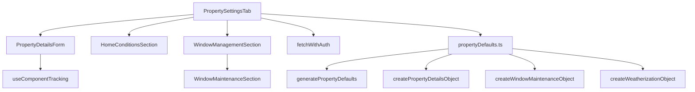

# PropertySettingsTab

## Overview

The `PropertySettingsTab` component provides a fully integrated property settings management interface directly within the dashboard. It allows users to view and edit property settings without leaving the dashboard experience. The component auto-populates property settings with sensible defaults derived from the user's audit data when no settings exist.

## Key Features

- **Auto-population from audit data**: When property settings don't exist, the system automatically generates defaults based on audit information
- **Integrated into dashboard**: Accessible as a tab in the dashboard, eliminating navigation to a separate settings page
- **Comprehensive property management**: Includes property details, home conditions, and window management
- **Robust error handling**: Proper validation with clear error messaging
- **Detailed logging**: Extensive logging for debugging and event tracking

## Component Structure



## Dependencies / Imports

- React components and hooks (`useState`, `useEffect`)
- UI components (`Button`, `Alert`, etc.)
- Icons from `lucide-react`
- Property forms (`PropertyDetailsForm`, `HomeConditionsSection`, `WindowManagementSection`)
- Utility functions:
  - `fetchWithAuth` for API communication
  - `useComponentTracking` for analytics
  - Property default generators from `propertyDefaults.ts`

## API Integration

The component interacts with the following API endpoints:

- `API_ENDPOINTS.SETTINGS.PROPERTY` - For retrieving and updating property details
- `API_ENDPOINTS.SETTINGS.WINDOWS` - For retrieving and updating window maintenance data
- `API_ENDPOINTS.SETTINGS.WEATHERIZATION` - For retrieving weatherization data
- `API_ENDPOINTS.ENERGY_AUDIT` - For retrieving audit data (used for auto-population)
- `API_ENDPOINTS.AUTH.PROFILE` - For retrieving user information

## Auto-Population Logic

When property settings don't exist, the component:

1. Retrieves the latest energy audit data
2. Uses the `generatePropertyDefaults` utility to create sensible defaults based on audit data
3. Creates property detail objects using utility functions
4. Saves these defaults to the backend automatically
5. Updates the UI to reflect the newly created settings

## Error Handling

The component implements comprehensive error handling:

- Data validation before API calls to prevent 400 errors
- Clear error messages for users
- Detailed console logging for debugging
- Graceful fallbacks when operations fail

## Usage Example

```tsx
// Within the dashboard layout
<SimpleDashboardLayout>
  {activeTab === 'property-settings' ? (
    <PropertySettingsTab 
      isLoading={isLoading} 
      onRefresh={handleRefreshDashboard} 
    />
  ) : (
    // Other dashboard content
  )}
</SimpleDashboardLayout>
```

## Additional Notes

- The component implements centralized request tracking using UUIDs for correlation
- It uses performance measurements for timing API operations
- All settings forms in this tab share the same validation and error handling patterns
