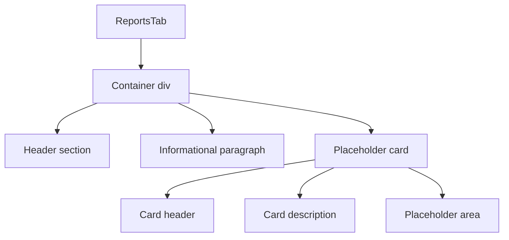

# ReportsTab Component

## Overview

The `ReportsTab` component is a placeholder tab in the dashboard that will eventually house reports functionality. Currently, it provides a visual placeholder with instructional text indicating that report functionality will be available in the future.

## Key Features

- Serves as a visual placeholder for future reports functionality
- Maintains consistent styling with the rest of the dashboard
- Provides clear messaging about upcoming features

## Component Structure



## Implementation Details

The component is implemented as a simple React functional component that returns static JSX. There is no dynamic functionality at this time, as it's intended to be a placeholder for future development.

```jsx
const ReportsTab: React.FC = () => {
  return (
    <div className="bg-white rounded-lg shadow p-6">
      <h2 className="text-lg font-semibold mb-4">Reports</h2>
      <p className="text-gray-500">Report functionality will be available soon.</p>
      
      {/* Placeholder card */}
      <div className="mt-6 border border-gray-200 rounded-lg p-4 bg-gray-50">
        <h3 className="text-md font-medium text-gray-700 mb-2">Energy Audit Reports</h3>
        <p className="text-sm text-gray-500 mb-4">
          View and download detailed reports of your energy audits and track improvements over time.
        </p>
        <div className="flex justify-center items-center h-40 bg-gray-100 rounded-md border border-dashed border-gray-300">
          <span className="text-gray-400">Reports feature coming soon</span>
        </div>
      </div>
    </div>
  );
};
```

## Integration

The `ReportsTab` component is integrated into the dashboard via:

1. Export in the `src/components/dashboard2/index.ts` barrel file
2. Import and conditional rendering in the `SimpleDashboardLayout` component based on the active tab state
3. Tab navigation in the layout that triggers the display of this component when the "Reports" tab is clicked

## Future Development

This component is intended to be expanded in the future to include:

- Historical energy audit reports
- PDF generation and download capabilities
- Data visualization for long-term energy usage trends
- Comparison tools for before/after implementation analysis

## Related Files

- `src/components/dashboard2/SimpleDashboardLayout.tsx` - Parent component that conditionally renders this tab
- `src/components/dashboard2/index.ts` - Barrel file that exports this component
- `src/pages/NewUserDashboardPage.tsx` - Page component that uses the dashboard layout
