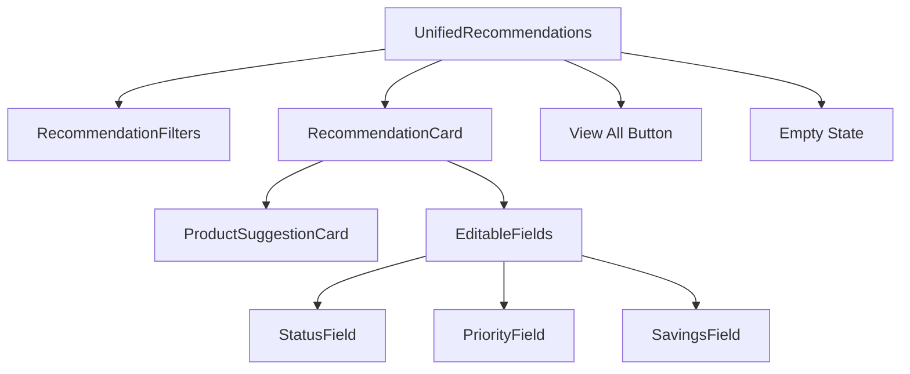

# UnifiedRecommendations Component

## Overview

The `UnifiedRecommendations` component is a flexible system that renders recommendation data with three different display modes:
- **Compact**: Simplified view for Dashboard with limited information
- **Detailed**: Full view with product suggestions for Reports (read-only)
- **Interactive**: Full view with editing capabilities for Reports

This component serves as a single source of truth for recommendation display, creating a consistent user experience across different contexts of the application.

## Key Features

- Multi-mode rendering based on display context
- Consistent filtering based on user product preferences
- Built-in state management for interactive editing 
- Product suggestion integration
- Real-time status updates and error handling
- Edit history tracking
- Responsive grid layouts for different screen sizes

## Props/Interfaces

```typescript
interface UnifiedRecommendationsProps {
  // Core data
  recommendations: AuditRecommendation[];
  userCategories?: string[];
  budgetConstraint?: number;
  
  // Display configuration
  displayMode: 'compact' | 'detailed' | 'interactive';
  maxRecommendations?: number;
  showProductSuggestions?: boolean;
  
  // Interactive functionality
  auditId?: string | null;
  isLoading?: boolean;
  onRefresh?: () => void;
  
  // Edit functionality (for interactive mode)
  onUpdateStatus?: (id: string, status: RecommendationStatus, actualSavings?: number) => Promise<void>;
  onUpdatePriority?: (id: string, priority: RecommendationPriority) => Promise<void>;
  onUpdateImplementationDetails?: (id: string, date: string, cost: number) => Promise<void>;
  
  // Data source metadata
  isDefaultData?: boolean;
  dataSource?: 'detailed' | 'generated' | 'empty';
}
```

## Component Structure



## Dependencies/Imports

- **RecommendationFilters**: For filtering recommendations based on user preferences
- **RecommendationCard**: For displaying individual recommendations
- **ProductSuggestionCard**: For displaying product recommendations 
- **formatCurrency**: For formatting monetary values
- **productRecommendationService**: For fetching product matches and filtering
- **[[AuditRecommendation]]**: Core data type
- **[[RecommendationStatus]]**: Status constants
- **[[RecommendationPriority]]**: Priority constants
- **[[ProductRecommendationMatch]]**: Product suggestion interface

## Implementation Details

### Display Modes

The component renders different UI elements based on the `displayMode` prop:

1. **Compact Mode**:
   - Limited data shown (title, description, estimated savings)
   - No product suggestions
   - "View All" button to detailed report
   - Max 3 recommendations by default

2. **Detailed Mode**:
   - Full information including financial data
   - Product suggestions displayed
   - Read-only (no edit controls)

3. **Interactive Mode**:
   - All features from detailed mode
   - Edit controls for status, priority, implementation details
   - Real-time feedback on save/error
   - Edit history tracking

### Filtering Logic

Recommendations are filtered based on user categories when relevant:

```typescript
// Filter recommendations based on user categories
useEffect(() => {
  if (showAllRecommendations) {
    setFilteredRecommendations(recommendations);
  } else {
    setFilteredRecommendations(
      filterRecommendationsByUserPreferences(recommendations, userCategories)
    );
  }
}, [recommendations, userCategories, showAllRecommendations]);
```

### Product Matching

The component fetches product matches from the recommendation service:

```typescript
// Fetch product matches when recommendations or display mode change
useEffect(() => {
  const fetchProductMatches = async () => {
    if (!showProductSuggestions || displayMode === 'compact') {
      return;
    }
    
    setMatchesLoading(true);
    try {
      const matches = await matchProductsToRecommendations(
        filteredRecommendations,
        userCategories,
        budgetConstraint
      );
      setProductMatches(matches);
    } catch (error) {
      console.error('Error fetching product matches:', error);
    } finally {
      setMatchesLoading(false);
    }
  };
  
  fetchProductMatches();
}, [filteredRecommendations, userCategories, budgetConstraint, showProductSuggestions, displayMode]);
```

## Related Files

- **src/components/recommendations/RecommendationCard.tsx**: Individual recommendation display
- **src/components/recommendations/ProductSuggestionCard.tsx**: Product card display
- **src/components/recommendations/RecommendationFilters.tsx**: Filtering controls
- **src/components/dashboard/EnhancedDashboardRecommendationsAdapter.tsx**: Dashboard adapter
- **src/components/reports/EnhancedReportRecommendationsAdapter.tsx**: Reports adapter
- **src/services/productRecommendationService.ts**: Product matching service
- **src/types/energyAudit.ts**: Core type definitions

## Notes/To-Do

- Consider implementing virtualized rendering for large recommendation lists
- Add analytics tracking for recommendation interactions
- Add unit tests for different display modes
- Implement additional sorting options beyond priority
