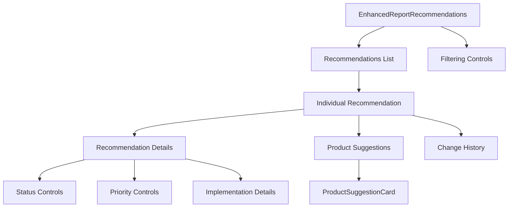

# Enhanced Report Recommendations Component

## Overview

The `EnhancedReportRecommendations` component provides an improved visualization and interaction experience for energy audit recommendations in reports. It extends the original recommendations component with additional features like product suggestions based on user preferences and budget constraints.

## Key Features

- **Recommendation display**: Shows recommendations with priority, status, implementation cost, and potential savings
- **Product suggestions**: Displays tailored product suggestions for each recommendation based on user preferences
- **Recommendation filtering**: Allows filtering recommendations by user-selected categories
- **Interactive editing**: Supports updating recommendation status, priority, and implementation details
- **Change tracking**: Records and displays a history of changes made to recommendations
- **Budget awareness**: Highlights products that fit within the user's defined budget constraints
- **Subcategory matching**: Uses both main categories and subcategories for more precise product matching
- **Fallback links**: Provides alternative product sources when specific products aren't available

## Component Structure



## Props/Interfaces

| Prop | Type | Required | Description |
|------|------|----------|-------------|
| `recommendations` | `AuditRecommendation[]` | Yes | List of recommendations to display |
| `userCategories` | `string[]` | No | User's preferred product categories |
| `budgetConstraint` | `number` | No | User's budget constraint |
| `onUpdateStatus` | `Function` | No | Callback to update recommendation status |
| `onUpdatePriority` | `Function` | No | Callback to update recommendation priority |
| `onUpdateImplementationDetails` | `Function` | No | Callback to update implementation details |

## Dependencies/Imports

- React hooks: `useState`, `useEffect`
- Types: `AuditRecommendation`, `RecommendationStatus`, `RecommendationPriority`
- Icons: `Calendar`, `DollarSign`, `Clock`, etc. from 'lucide-react'
- Related components: `ProductSuggestionCard`
- Services: `filterRecommendationsByUserPreferences`, `matchProductsToRecommendations` from `productRecommendationService`
- Utils: `getRecommendationCost`, `getRecommendationSavings`, `getActualSavings`, `formatCurrency`, `formatPercentage` from `financialCalculations.ts`

## Implementation Details

### Product Suggestions

The component fetches product suggestions for each recommendation using the `matchProductsToRecommendations` function from the `productRecommendationService`. Products are matched based on:

1. Recommendation type and title (e.g., HVAC, lighting) - using more specific matching for better categorization
2. User category preferences (if specified)
3. Budget constraints
4. Both main categories and subcategories (e.g., "lighting" → "Light Bulbs" or "Light Fixtures")

Products that fit within the user's budget are highlighted with a green border and "Within Budget" tag.

When specific products aren't available, the component:
1. Displays a user-friendly message about potential Energy Star link issues
2. Provides alternative links to Amazon search and Energy Star general product pages
3. Uses category-specific language to guide users to the right type of product

The improved mapping system uses both the recommendation type and title to determine the appropriate product category and subcategory, allowing for more precise product matching and preventing duplicate suggestions across different recommendation types.

### Recommendation Filtering

Users can toggle between viewing all recommendations or only those related to their preferred product categories. This helps focus the report on areas the user is most interested in.

### Edit History

The component maintains a history of changes made to recommendations (status, priority, implementation details) and allows users to view this history in an expandable section.

## Usage Example

```tsx
// In InteractiveReportPage.tsx
<EnhancedReportRecommendations 
  recommendations={reportData.recommendations}
  userCategories={reportData.productPreferences?.categories || []}
  budgetConstraint={reportData.productPreferences?.budgetConstraint}
  onUpdateStatus={handleUpdateStatus}
  onUpdatePriority={handleUpdatePriority}
  onUpdateImplementationDetails={handleUpdateImplementationDetails}
/>
```

## Related Files

- `src/components/reports/ProductSuggestionCard.tsx`: Card component for displaying product suggestions
- `src/services/productRecommendationService.ts`: Service for fetching and matching product recommendations
- `src/types/report.ts`: Updated to include productPreferences
- `backend/src/services/ReportDataService.ts`: Enhanced to include product preferences in report data
- `src/assets/product-images/`: Directory containing category-specific product images

## Notes/To-Do

- Consider adding an option to sort recommendations by different criteria (e.g., ROI, cost)
- Implement product comparison feature directly within the recommendations view
- Add ability to filter recommendations by status (active vs. implemented)
- Consider adding more product images for other categories (insulation, windows/doors, water heaters, smart home)
- Add support for more subcategories in the product mapping system
