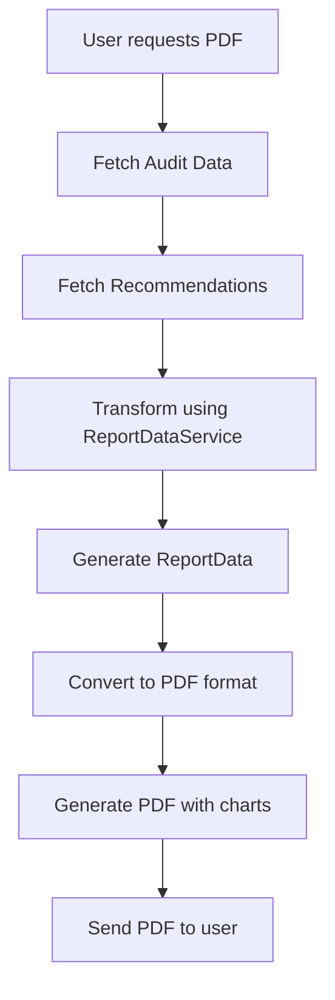

# PDF Report Generation

## Overview

The PDF report generation system creates downloadable PDF reports containing energy audit results, recommendations, savings information, and graphical visualizations for users. These reports can be downloaded by both authenticated and anonymous users.

## Key Features

- Dynamic generation of PDF reports from audit data
- Comprehensive charts and visualizations
- Consistent data between interactive dashboard and PDF reports
- Proper handling of missing or incomplete data fields
- Support for anonymous downloads (no login required)

## Implementation Details

### Data Flow



### Key Components

1. **Route Handler**: `/api/energy-audit/:id/report` endpoint in `energyAudit.ts`
2. **Data Service**: `ReportDataService` for consistent data transformation
3. **PDF Generator**: `ReportGenerationService.generateReport` method
4. **Data Transformation**: Converts dashboard format to PDF format

### Data Consistency Implementation

The system ensures consistency between interactive dashboard data and PDF reports through:

- **Unified Data Source**: Both the interactive dashboard and PDF reports use the same `ReportDataService`
- **Common Data Structure**: The `ReportData` interface serves as the common format
- **Standardized Calculations**: Financial calculations use the same utility functions
- **Field Mapping**: Careful mapping between dashboard fields and PDF fields

### Error Handling

- Comprehensive validation of audit data before processing
- Default values for missing or incomplete data
- Detailed error logging with context information
- User-friendly error messages based on environment

## Dependencies / Imports

- `ReportGenerationService` - Handles the PDF generation process
- `ReportDataService` - Normalizes audit data for consistent processing
- `PDFKit` - PDF document generation library
- `Chart.js` - Chart generation for visualizations
- `Canvas` - Required for server-side chart rendering

## Usage Examples

```typescript
// Route implementation
router.get('/:id/report', [optionalTokenValidation, ...reportGenerationLimiter], 
  async (req: AuthenticatedRequest, res: Response) => {
    // Validation and data fetching
    const auditId = req.params.id;
    const audit = await energyAuditService.getAuditById(auditId);
    const recommendations = await energyAuditService.getRecommendations(auditId);
    
    // Use common data service for consistent results
    const reportData = await reportDataService.generateReportData(audit, recommendations);
    
    // Convert to format needed for PDF generation
    const transformedAudit = convertToPdfFormat(reportData);
    
    // Generate PDF
    const report = await reportGenerationService.generateReport(transformedAudit, recommendations);
    
    // Send to client
    res.setHeader('Content-Type', 'application/pdf');
    res.send(report);
});
```

## Notes and To-Do

- Future improvement: Refactor PDF generator to accept ReportData directly
- Consider adding customization options (e.g., including/excluding sections)
- Potential performance optimization for large reports by adding caching

## Related Files

- [[frontend/components/reports/enhanced_report_recommendations]]
- [[frontend/components/reports/report_charts]]
- [[frontend/components/reports/report_summary_data_validation]]
- [[data_flows/report_data_flow]]
- [[backend/services/report_generation_service]]
