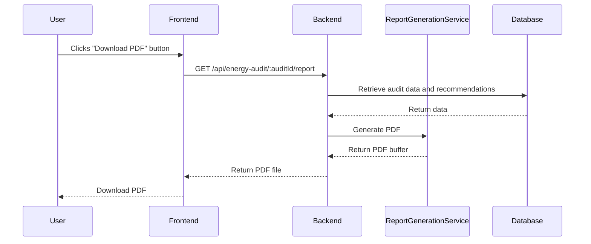

# PDF Report Generation

## Overview

The PDF Report Generation feature allows users to export their energy audit data and recommendations as a professionally formatted PDF document. This provides a portable, shareable version of their audit results that can be saved, printed, or sent to contractors/service providers.

## Architecture

The PDF generation process follows these steps:

1. The user initiates PDF generation from the Reports tab in the Dashboard
2. The frontend sends a request to the backend API endpoint
3. The backend retrieves the audit data and recommendations
4. The `ReportGenerationService` transforms the data into a structured PDF document
5. The PDF is returned to the user for download

## Key Components

### Backend Service

- **ReportGenerationService**: Main service that handles PDF generation
  - Located at `backend/src/services/ReportGenerationService.ts`
  - Uses PDFKit and Canvas/ChartJS for PDF creation and chart generation
  - Implements error handling and logging

### API Routes

- **Energy Audit Routes**: Contains the endpoint that triggers PDF generation
  - Located at `backend/src/routes/energyAudit.ts`
  - Handles the GET request to `/:auditId/report`

### Frontend Components

- **ReportsTab**: UI component that contains the "Download PDF" button
  - Located at `src/components/dashboard/ReportsTab.tsx`
  - Uses the report service to make the API request

## Data Flow



## Field Naming Conventions

To ensure compatibility between database records (snake_case) and JavaScript objects (camelCase), the service implements robust handling of both naming conventions:

```typescript
// Example of field access with dual convention support
const productPreferences = auditData.productPreferences || 
                          (auditData as any).product_preferences;
```

Refer to the [[field_naming_conventions]] document for more details on this approach.

## PDF Content Sections

The generated PDF includes the following sections:

1. **Header & Metadata**: Report title, date, ID
2. **Executive Summary**: Key metrics and findings
3. **Property Information**: Details about the audited property
4. **Current Conditions**: Summary of existing energy systems
5. **HVAC System Details**: Heating and cooling system information
6. **Energy Consumption**: Usage data and patterns
7. **Energy Breakdown Chart**: Visual representation of energy sources
8. **Energy Consumption Analysis**: Detailed breakdown of usage factors
9. **Efficiency Metrics Analysis**: Radar chart of efficiency metrics
10. **HVAC Performance Analysis**: Comparison with target values
11. **Lighting Assessment** (if data available): Bulb types and patterns
12. **Recommendations**: Prioritized list of energy-saving measures
13. **Savings Analysis**: Charts comparing estimated vs. actual savings
14. **Product Recommendations** (if preferences available): Suggested products
15. **Summary**: Total potential savings and implementation status

## Error Handling

The service implements comprehensive error handling to deal with:

- Missing or invalid audit data
- Various field naming conventions (camelCase vs snake_case)
- Data type issues (null, undefined, NaN values)
- Chart generation failures

Each major section is wrapped in try/catch blocks to ensure that failures in one section don't prevent the entire report from generating.

## Testing

The PDF generation can be tested using the test script:

```bash
node test-pdf-generation.mjs
```

This script generates sample PDFs with different data scenarios to ensure the service can handle:

1. Complete data
2. Incomplete data
3. Edge case data
4. Problematic data (null/undefined values)
5. Zero recommendations

## Related Documentation

- [[report_data_flow]]: Overview of data flow for reports
- [[field_naming_conventions]]: Guidelines for field naming consistency
- [[enhanced_report_recommendations]]: Documentation for recommendation display
- [[report_charts]]: Details about chart generation in reports
