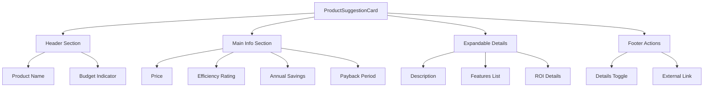

# Product Suggestion Card Component

## Overview

The `ProductSuggestionCard` component displays individual product suggestions within the recommendations section of the energy audit report. It provides a compact yet informative representation of products that match a user's energy efficiency needs, highlighting key metrics and indicating budget compatibility.

## Key Features

- **Compact product display**: Shows essential product information in a space-efficient card format
- **Product images**: Displays category-specific product images to enhance visual recognition
- **Budget awareness**: Visually highlights products that fit within the user's defined budget
- **Key metrics**: Displays price, energy efficiency rating, savings, and payback period
- **Expandable details**: Allows users to view additional product information on demand
- **Smart external linking**: Always provides product links, using fallback URLs when specific links aren't available
- **Energy Star integration**: Automatically generates links to Energy Star product categories when specific URLs are available
- **Amazon fallback**: Uses Amazon search links for categories where Energy Star links are known to be broken
- **Conditional link labels**: Uses "View Product" for direct links and "Browse Similar" for category fallbacks
- **Category display**: Shows the product category to help users understand the recommendation context

## Component Structure



## Props/Interfaces

| Prop | Type | Required | Description |
|------|------|----------|-------------|
| `product` | `Product` | Yes | Product data object to display |
| `budgetConstraint` | `number` | No | User's budget constraint for highlighting |

## Dependencies/Imports

- React hooks: `useState`
- Types: `Product` from `productRecommendationService`
- Utilities: `formatCurrency`, `formatPercentage` from `financialCalculations`
- Icons: `DollarSign`, `Star`, `Clock`, `Info`, `ExternalLink` from 'lucide-react'

## Implementation Details

### Budget Compatibility Display

The component visually indicates whether a product fits within the user's defined budget constraint:

```tsx
const isWithinBudget = !budgetConstraint || product.price <= budgetConstraint;

// Applied in the component styling
<div className={`border rounded-md overflow-hidden ${
  isWithinBudget ? 'border-green-200' : 'border-gray-200'
} hover:shadow-md transition-shadow duration-200`}>
```

### Expandable Product Details

Product details are hidden by default and can be expanded on demand to save space:

```tsx
const [isExpanded, setIsExpanded] = useState(false);

// Toggle button in the UI
<button
  onClick={() => setIsExpanded(!isExpanded)}
  className="text-blue-600 hover:text-blue-800 text-xs flex items-center"
>
  <Info className="h-3 w-3 mr-1" />
  {isExpanded ? 'Less Details' : 'More Details'}
</button>
```

### Financial Metrics Display

The card highlights important financial metrics to help users make informed decisions:

- Product price
- Energy efficiency rating
- Estimated annual savings
- Payback period in years

## Usage Example

```tsx
import { Product } from '../../services/productRecommendationService';
import ProductSuggestionCard from './ProductSuggestionCard';

const ProductList: React.FC<{ 
  products: Product[], 
  budgetConstraint?: number 
}> = ({ products, budgetConstraint }) => {
  return (
    <div className="grid grid-cols-1 sm:grid-cols-2 lg:grid-cols-3 gap-3">
      {products.map(product => (
        <ProductSuggestionCard
          key={product.id}
          product={product}
          budgetConstraint={budgetConstraint}
        />
      ))}
    </div>
  );
};
```

## Related Files

- `src/components/reports/EnhancedReportRecommendations.tsx`: Parent component that uses ProductSuggestionCard
- `src/services/productRecommendationService.ts`: Service providing product data and matching logic
- `src/utils/financialCalculations.ts`: Utility functions for formatting currency and percentages
- `src/types/report.ts`: Types related to report data structures
- `energy-audit-vault/frontend/utils/financial_calculations.md`: Documentation for financial calculations utilities

## Notes/To-Do

- Consider adding product images to make cards more visually engaging
- Add ability to compare multiple products side-by-side
- Implement direct add-to-cart or purchase functionality
- Provide more detailed efficiency information for specific product categories
