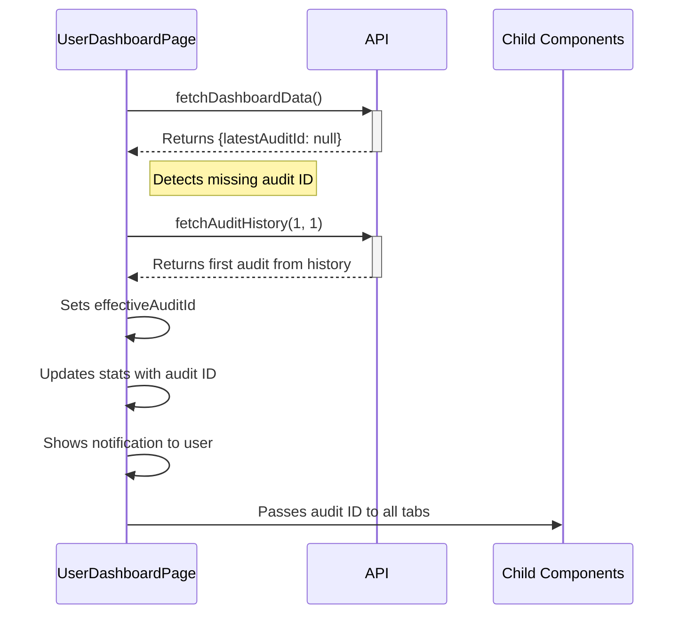

# Dashboard Auto-Loading Latest Audit

## Overview
The Dashboard Auto-Loading feature enhances user experience by automatically loading the most recent audit data when a user first logs in. This feature prevents empty dashboard states by fetching and utilizing the latest audit from the user's history when the dashboard's main API response doesn't include a valid audit ID.

## Problem Solved
Previously, when a user logged into the dashboard, the initial API response sometimes returned:
```json
{
  "hasLatestAuditId": false,
  "latestAuditId": null, 
  "newAuditFromUrl": null
}
```

This resulted in:
- Empty statistics in the Overview tab
- No recommendations showing in the Recommendations tab
- Disabled buttons in the Reports tab
- A degraded initial user experience

The feature solves this by automatically fetching the first audit from the history endpoint and using it as a fallback.

## Implementation Details

### Core Logic
```typescript
// In UserDashboardPage.tsx
useEffect(() => {
  // Only attempt to fetch a fallback if no valid audit ID exists yet
  if ((!stats.latestAuditId || 
       stats.latestAuditId === 'null' || 
       stats.latestAuditId === 'undefined') && 
      !effectiveAuditId) {
    
    // Fetch just the first audit from history
    fetchAuditHistory(1, 1)
      .then(data => {
        if (data.audits?.length > 0 && data.audits[0]?.id) {
          const firstAuditId = data.audits[0].id;
          
          // Store the effective ID
          setEffectiveAuditId(firstAuditId);
          
          // Also update the stats object so all child components receive it
          setStats(prevStats => ({
            ...prevStats,
            latestAuditId: firstAuditId
          }));
          
          setUsingFallbackAudit(true);
        }
      });
  }
}, [stats.latestAuditId, effectiveAuditId]);
```

### User Notification
When an audit is auto-loaded, a notification is displayed to inform the user:

```tsx
{usingFallbackAudit && (
  <div className="mb-4 text-sm p-3 bg-blue-50 border border-blue-200 rounded-md text-blue-700 flex items-center justify-between">
    <p>Loaded your most recent audit from history.</p>
    <Button
      onClick={() => setRefreshKey(prev => prev + 1)}
      variant="outline"
      size="sm"
      className="ml-4 text-xs flex items-center"
    >
      <RefreshCw className="h-3 w-3 mr-1" />
      <span>Refresh Dashboard</span>
    </Button>
  </div>
)}
```

## Data Flow



## Components Affected
- **UserDashboardPage**: Main component containing the auto-loading logic
- **DashboardOverview**: Receives the effective audit ID via stats prop
- **RecommendationsTab**: Receives audit recommendations through stats
- **ReportsTab**: Uses the effective audit ID for report access

## Related Files
- [[frontend/pages/user_dashboard_page|UserDashboardPage]]
- [[frontend/components/dashboard/dashboard_overview|DashboardOverview]]
- [[frontend/components/dashboard/reports_tab|ReportsTab]]
- [[frontend/services/report_service|ReportService]]

## Testing Notes
- Test with both new users (no audit history) and existing users
- Verify the notification appears only when an audit is auto-loaded
- Test refresh functionality to ensure it properly reloads dashboard data
