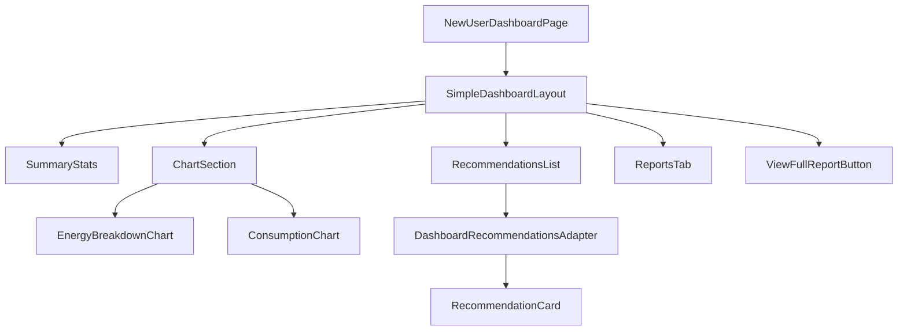

# NewUserDashboardPage

## Overview

The `NewUserDashboardPage` is the redesigned dashboard experience, accessible via the `/dashboard2` route. As of April 2025, this is now the primary dashboard that users access when navigating to `/dashboard` (which redirects to `/dashboard2`). The new dashboard offers a simplified, more intuitive user experience with better visual representation of energy data and recommendations.

## Key Features

- Simplified dashboard layout focusing on key user actions and information
- Improved energy visualization with room-based energy breakdown
- More accessible and intuitive recommendation interface
- Responsive design optimized for all device sizes
- Enhanced data presentation with improved charts and statistics
- Direct access to full energy report via prominent blue button

## Component Structure



## URL Routing

As of April 2025, the routing configuration redirects users from `/dashboard` to `/dashboard2`, making this the primary dashboard experience:

```typescript
// In App.tsx
<Route
  path="/dashboard"
  element={
    <ProtectedRoute>
      <Navigate to="/dashboard2" replace />
    </ProtectedRoute>
  }
/>
<Route
  path="/dashboard2"
  element={
    <ProtectedRoute>
      <NewUserDashboardPage />
    </ProtectedRoute>
  }
/>
```

## Data Flow

The dashboard fetches data from the enhanced dashboard API endpoint:
- Summary statistics (savings, completed audits, etc.)
- Room-based energy breakdown data
- Enhanced consumption visualization data
- Unified recommendations system data

## Dependencies/Imports

- React and React Router for component structure and navigation
- Recharts library for enhanced data visualization
- Tailwind CSS for responsive styling
- Custom hooks for API data fetching and authentication
- Dashboard2 component modules:
  - SimpleDashboardLayout
  - SummaryStats
  - ChartSection
  - RecommendationsList
  - ReportsTab

## Implementation Details

The NewUserDashboardPage implements:

1. A simplified top-level component structure for better maintainability
2. Enhanced visualization of room-based energy consumption data
3. Integration with the unified recommendations system
4. User-friendly data explanations with tooltips and context
5. Integration with the report system for deeper data exploration

## Related Files

- [[SimpleDashboardLayout]] - Main layout component for the new dashboard
- [[SummaryStats]] - Component displaying key usage metrics
- [[ChartSection]] - Enhanced energy visualization components
- [[RecommendationsList]] - Unified recommendations display
- [[DashboardRecommendationsAdapter]] - Adapter for unified recommendation system
- [[ReportsTab]] - Access to detailed energy audit reports

## Technical Decisions

1. **URL Routing Redirection**:
   The original `/dashboard` route now redirects to `/dashboard2`, making the new design the primary dashboard experience while maintaining backward compatibility for any existing links.

2. **Simplified Component Structure**:
   The new dashboard uses a more modular component structure with clear responsibility separation.

3. **Improved Data Visualization**:
   Room-based energy breakdowns provide more intuitive understanding of energy usage patterns.

4. **Unified Recommendations**:
   Integration with the unified recommendation system ensures consistent recommendations across all parts of the application.

5. **Improved User Context**:
   Added more explanations and tooltips to help users understand their energy data.

6. **Direct Report Access**:
   Added a prominent blue button at the bottom of the dashboard that links users directly to their full energy report for deeper analysis.

## Backend API Dependencies

- Enhanced dashboard endpoint with room-based energy data
- Unified recommendations service integration
- User profile integration for customized content

## Notes/To-Do

- Consider adding energy usage forecasting based on historical patterns
- Explore options for adding interactive goal-setting features
- Evaluate performance of the charts on lower-end devices
- Consider A/B testing different visualization options
- Monitor usage of the "View Full Energy Report" button to evaluate its effectiveness
