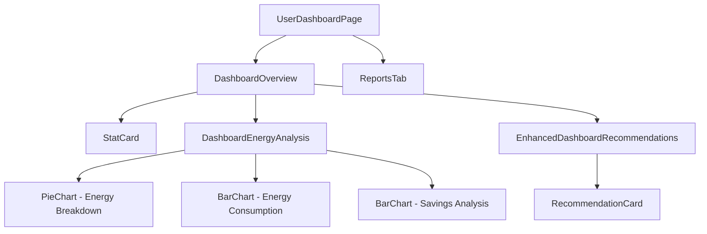

# UserDashboardPage

## Overview

The `UserDashboardPage` is the main dashboard screen that users see after logging in. It provides an overview of energy savings, recommendations, and access to detailed reports. The page has been redesigned to focus on the most valuable content and remove redundant information.

## Key Features

- Streamlined tab navigation (Overview and Reports only)
- Enhanced statistics cards showing energy audit metrics
- Energy analysis with interactive charts (when available)
- Enhanced recommendations section with direct links to the full interactive report
- Responsive design for all device sizes

## Component Structure



## Data Flow

The dashboard fetches data from the enhanced dashboard API endpoint, which provides:
- Basic statistics (total savings, completed audits, etc.)
- Monthly savings trend data
- Energy analysis data (when available)
- Enhanced recommendations with additional details
- User preferences for filtering

## Props/Interfaces

```typescript
interface DashboardStats {
  totalSavings: {
    estimated: number;
    actual: number;
    accuracy: number;
  };
  completedAudits: number;
  activeRecommendations: number;
  implementedChanges: number;
  monthlySavings: Array<{
    month: string;
    estimated: number;
    actual: number;
  }>;
  recommendations?: any[];
  latestAuditId?: string | null;
  userId?: string;
  
  // Enhanced data fields
  energyAnalysis?: {
    energyBreakdown: ChartDataPoint[];
    consumption: ChartDataPoint[];
    savingsAnalysis: SavingsChartDataPoint[];
  };
  enhancedRecommendations?: AuditRecommendation[];
  productPreferences?: {
    categories: string[];
    budgetConstraint?: number;
  };
}
```

## Dependencies/Imports

- React and React Router for component structure and navigation
- Recharts library for data visualization
- Lucide React for iconography
- Tailwind CSS for styling
- Custom hooks for API interaction and authentication

## Implementation Details

The UserDashboardPage has been significantly refactored to:

1. Remove redundant tabs (Recommendations and Product Comparisons)
2. Add new enhanced data types for improved visualizations
3. Provide graceful fallbacks when enhanced data is unavailable
4. Focus user attention on the most valuable content
5. Implement a more direct path to the interactive reports

## Related Files

- [[DashboardOverview]] - Main content component for the Overview tab
- [[DashboardEnergyAnalysis]] - Energy usage visualization component
- [[EnhancedDashboardRecommendations]] - Improved recommendations component
- [[ReportsTab]] - Component for viewing and managing energy audit reports

## Technical Decisions

1. **Removed Redundant Tabs**: 
   The Recommendations and Product Comparisons tabs were removed as they duplicated functionality available in the Interactive Reports with less detail and utility.

2. **Enhanced Data Flow**:
   The backend now provides more detailed data structures for enhanced visualizations, while maintaining backward compatibility with existing components.

3. **Conditional Rendering**:
   Components intelligently fallback to simpler visualizations when enhanced data is not available.

4. **User Preferences Integration**:
   The dashboard now considers user category preferences when displaying recommendations.

## Backend API Changes

The dashboard uses an enhanced API endpoint (`/api/dashboard/stats`) that now provides:

- Energy breakdown data (pie chart)
- Energy consumption data (bar chart)
- Savings analysis data (comparative bar chart)
- Enhanced recommendations with additional metadata
- User preferences for filtering

## Notes/To-Do

- Consider adding personalized energy efficiency tips based on user data
- Implement a notification system for new recommendations
- Add ability to set energy saving goals and track progress
- Consider adding seasonal comparisons to help users understand energy usage patterns
