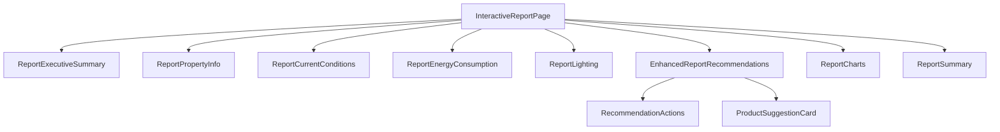
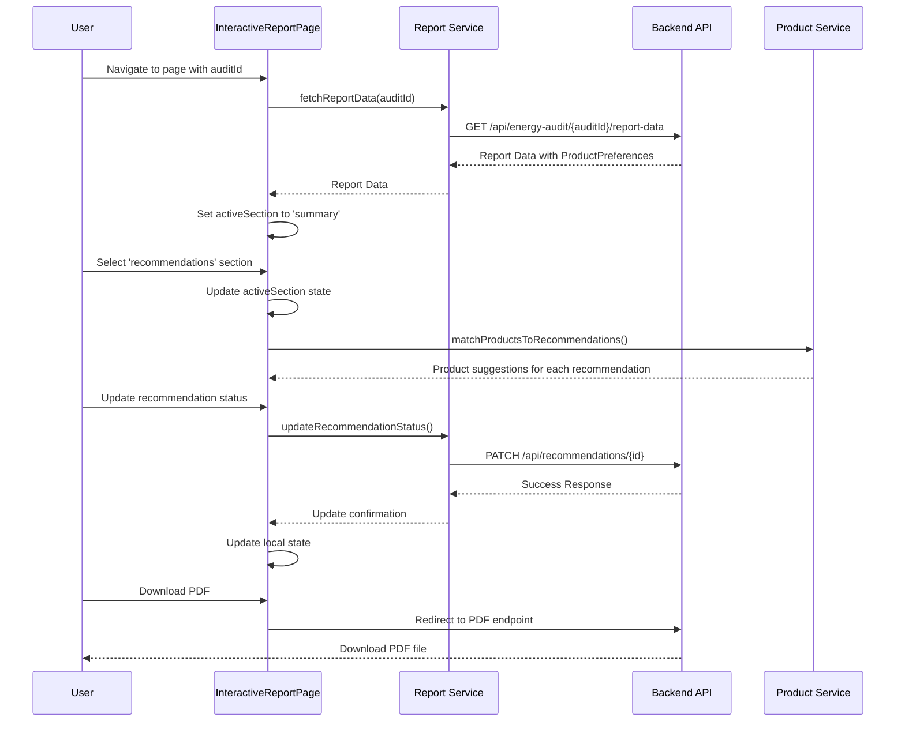

# Interactive Report Page

## Overview
The Interactive Report Page displays comprehensive energy audit results in a user-friendly, tabbed interface. This page allows users to view detailed information about their energy audit, interact with recommendations, and download a PDF version of the report. It serves as the primary way for users to understand their energy efficiency status and potential improvements.

## Key Features
- Tabbed interface with multiple report sections
- Interactive recommendation management (status, priority, implementation details)
- Dynamic data visualization through charts
- PDF report download functionality
- Error handling for missing or invalid audit data
- Product suggestions based on recommendations and user preferences

## Component Structure

## Dependencies / Imports
- **Route Utilities**:
  - [[frontend/utilities/routing|React Router]] - For URL parameter handling and navigation
  
- **API Services**:
  - [[frontend/services/report_service|Report Service]] - For fetching report data and updating recommendations
  - [[frontend/services/product_recommendation_service|Product Recommendation Service]] - For matching products to recommendations
  
- **Report Section Components**:
  - [[frontend/components/reports/report_executive_summary|ReportExecutiveSummary]]
  - [[frontend/components/reports/report_property_info|ReportPropertyInfo]]
  - [[frontend/components/reports/report_current_conditions|ReportCurrentConditions]]
  - [[frontend/components/reports/report_energy_consumption|ReportEnergyConsumption]]
  - [[frontend/components/reports/report_lighting|ReportLighting]]
  - [[frontend/components/reports/enhanced_report_recommendations|EnhancedReportRecommendations]]
  - [[frontend/components/reports/report_charts|ReportCharts]]
  - [[frontend/components/reports/report_summary|ReportSummary]]
  
- **Types**:
  - [[frontend/types/report_types|Report Types]]
  - [[frontend/types/energy_audit_types|Energy Audit Types]]

## State Management
- `reportData`: Stores the complete report data structure
- `loading`: Tracks API loading state
- `error`: Stores error messages
- `activeSection`: Controls which report section is currently displayed

## Data Flow

## API Interfaces
- **Fetch Report Data**:
  - Endpoint: GET `/api/energy-audit/${auditId}/report-data`
  - Returns: Complete ReportData structure with productPreferences
  
- **Update Recommendation Status**:
  - Endpoint: PATCH `/api/recommendations/${id}/status`
  - Payload: `{ status, actualSavings }`
  
- **Update Recommendation Priority**:
  - Endpoint: PATCH `/api/recommendations/${id}/priority`
  - Payload: `{ priority }`
  
- **Update Implementation Details**:
  - Endpoint: PATCH `/api/recommendations/${id}/implementation`
  - Payload: `{ implementationDate, implementationCost }`
  
- **Download PDF Report**:
  - Endpoint: GET `/api/energy-audit/${auditId}/report`
  - Returns: PDF file download

## Report Sections
1. **Executive Summary**: Overview of key energy metrics and potential savings
2. **Property Information**: Details about the property that was audited
3. **Current Conditions**: Assessment of current efficiency conditions
4. **Energy Consumption**: Breakdown of energy usage patterns
5. **Lighting Assessment**: Analysis of lighting systems and efficiency
6. **Recommendations**: Actionable recommendations with ROI details and product suggestions
7. **Energy Analysis**: Visualizations of energy usage and potential savings
8. **Summary**: Overall conclusions and next steps

## Enhanced Recommendations
The Interactive Report Page now uses the `EnhancedReportRecommendations` component instead of the original `ReportRecommendations` component. The enhanced version includes:

- Product suggestions specific to each recommendation
- Filtering based on user category preferences
- Budget-aware product highlighting
- Detailed product information with pricing and efficiency metrics
- Change history tracking for recommendations

The component takes user preferences from the report data and passes them to the product recommendation service to find suitable products for each recommendation.

## Error Handling
- Validates audit ID before making API requests
- Displays user-friendly error messages for invalid IDs or failed API requests
- Provides navigation back to previous page on error
- Gracefully handles recommendation update failures with console logging

## Related Files
- **Parent**: [[frontend/app|App Component]] (routing)
- **API Service**: [[frontend/services/report_service|Report Service]]
- **Types**: [[frontend/types/report_types|Report Types]]
- **Database Operations**: [[backend/routes/energy_audit_routes|Energy Audit API Routes]]
- **Product Recommendation**: [[frontend/services/product_recommendation_service|Product Recommendation Service]]
- **Product Display**: [[frontend/components/reports/product_suggestion_card|Product Suggestion Card]]

## Notes / To-Do
- Consider adding print-friendly view
- Add ability to share report with others
- Implement comparison view for multiple audits
- Add historical tracking for implemented recommendations
- Expand product suggestion database with more categories and options
