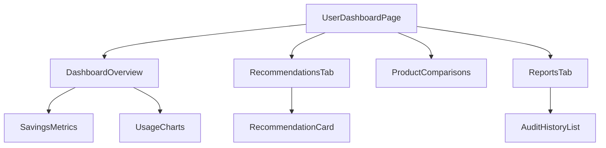
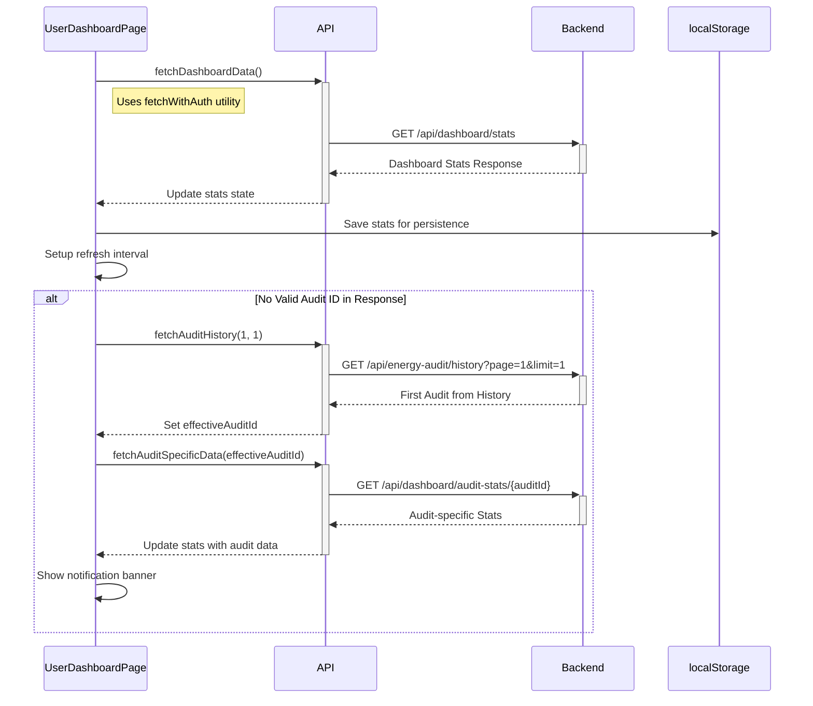

# User Dashboard Page

## Overview
The User Dashboard Page is the central hub for authenticated users, displaying their energy savings statistics, recommendations, product comparisons, and reports. It provides a comprehensive view of the user's energy efficiency progress and serves as a launching point for various actions.

## Key Features
- Overall energy savings statistics and metrics
- Tabbed interface for different dashboard sections
- Recommendation tracking and implementation status
- Product comparisons based on audit data
- Reports and audit history access
- Auto-refreshing data with configurable intervals

## Component Structure



## Dependencies / Imports
- **Internal Components**:
  - [[frontend/components/dashboard/dashboard_overview|DashboardOverview]] - Main dashboard statistics and charts
  - [[frontend/components/dashboard/recommendations_tab|RecommendationsTab]] - Recommendations listing and management
  - [[frontend/components/dashboard/product_comparisons|ProductComparisons]] - Product comparison tool
  - [[frontend/components/dashboard/reports_tab|ReportsTab]] - Reports and audit history

- **Utilities**:
  - [[frontend/utils/auth_utils|Auth Utilities]] - Authentication utilities for API calls
  - [[frontend/config/api|API Configuration]] - API endpoint configuration

## State Management
- `stats`: Dashboard statistics stored in local state and persisted to localStorage
- `isLoading`: Loading state for data fetching
- `error`: Error state for failed data fetching
- `activeTab`: Currently active dashboard tab
- `refreshKey`: Key used to force refresh of dashboard data
- `effectiveAuditId`: Fallback audit ID used when no audit ID is available in stats
- `usingFallbackAudit`: Flag indicating whether the dashboard is using a fallback audit from history

## Data Flow



## API Interfaces
- **Main Dashboard Stats**:
  - **Endpoint**: `API_ENDPOINTS.DASHBOARD.STATS`
  - **Method**: GET
  - **Auth Required**: Yes
  - **Query Parameters**: 
    - `newAudit` (optional): ID of a newly completed audit

- **Audit-specific Dashboard Stats**:
  - **Endpoint**: `API_ENDPOINTS.DASHBOARD.AUDIT_STATS(auditId)`
  - **Method**: GET
  - **Auth Required**: Yes
  - **Path Parameters**:
    - `auditId`: ID of the specific audit to fetch statistics for

## Response Data Structure
```typescript
interface DashboardStats {
  totalSavings: {
    estimated: number;
    actual: number;
    accuracy: number;
  };
  completedAudits: number;
  activeRecommendations: number;
  implementedChanges: number;
  monthlySavings: {
    month: string;
    estimated: number;
    actual: number;
  }[];
  lastUpdated?: string;
  refreshInterval?: number;
  latestAuditId?: string | null;
  recommendations?: any[];
  userId?: string;
}
```

## Error Handling
- Handles setup required error with prompt to complete property setup
- Displays general error with retry option
- Uses localStorage to persist data for offline/error scenarios
- Auto-loads fallback audit from history when no audit ID is available
- Shows notification banner when using fallback audit data

## Related Files
- **Parent**: [[frontend/app|App]] (routing)
- **Children**: Various dashboard component tabs
- **API**: [[backend/routes/dashboard_routes|Dashboard API Routes]]
- **Features**: [[frontend/features/auto_loading_latest_audit|Auto-Loading Latest Audit]]

## Notes / To-Do
- Consider adding export functionality for dashboard data
- Add filtering capabilities for recommendations
- Improve offline support with service worker caching
