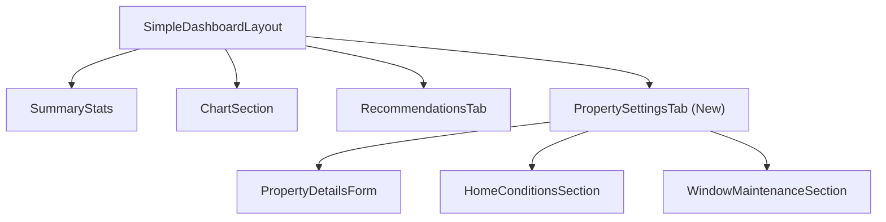
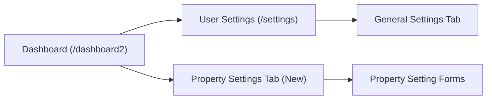
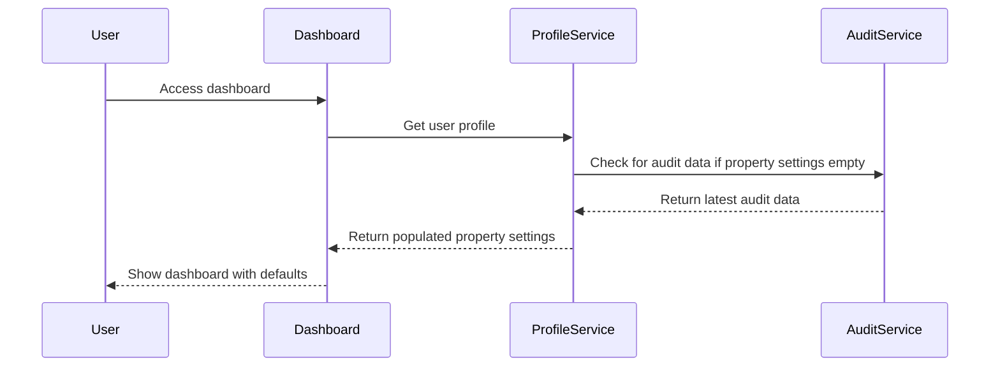

# Property Settings Rework

## Issue Overview

The current Property Settings implementation has several UX issues:

1. **Intrusiveness:** Users must fill in Property Settings before viewing the dashboard
2. **Navigation Issues:** Problems switching between general and property settings
3. **Poor Integration:** Property Settings accessed via separate page rather than dashboard
4. **Unclear Labeling:** Confusion between Property Settings and User Settings

These issues create friction for users, especially new users who just want to see their dashboard data before configuring detailed property settings.

## Solution Approach

The solution involves four key changes:

1. **Auto-populate Property Settings** with defaults from Audit decisions
2. **Add a Property Settings tab** to the dashboard for better integration
3. **Rename buttons and navigation** for clarity
4. **Remove the Property tab** from UserSettingsPage

## Component Changes

### Dashboard Components

### Navigation Flow Changes

## Data Flow Changes

### Property Settings Auto-Population

## Key Files to Modify

1. **User Profile Service:** `src/services/userProfileService.enhanced.ts`
   - Add logic to extract defaults from audit data
   - Ensure property settings are auto-populated

2. **Dashboard Layout:** `src/components/dashboard2/SimpleDashboardLayout.tsx`
   - Add new Property Settings tab
   - Update tab navigation

3. **New Component:** `src/components/dashboard2/PropertySettingsTab.tsx`
   - Create new component for property settings in dashboard
   - Reuse existing property settings components

4. **Settings Page:** `src/pages/UserSettingsPage.tsx`
   - Update to default to General tab
   - Remove property settings tab
   - Update navigation and button labels

5. **App Routing:** `src/App.tsx`
   - Update routing for settings pages
   - Add redirects if needed

## Implementation Considerations

### User Experience

The redesigned flow ensures:
- New users can immediately see their dashboard with sensible defaults
- Property settings are directly accessible within the dashboard context
- Navigation is clear with distinct labeling
- No information is lost - all existing property settings fields remain available

### Data Validation

- We'll need to ensure default values from audits are sensible
- Add validation before applying defaults
- Preserve any user-defined values during the transition

### Migration Strategy

The changes will be implemented in phases:
1. First add auto-population logic to ensure no dashboards are blocked
2. Add the dashboard Property Settings tab
3. Update navigation and routing
4. Remove the Property Settings tab from UserSettingsPage

## Related Components

- [[EnergyAuditForm]] - Source of audit data for defaults
- [[UserDashboardPage]] - Contains links to settings that need updating
- [[NewUserDashboardPage]] - Dashboard that will receive the new tab
- [[PropertyDetailsForm]] - Will be reused in the new tab
