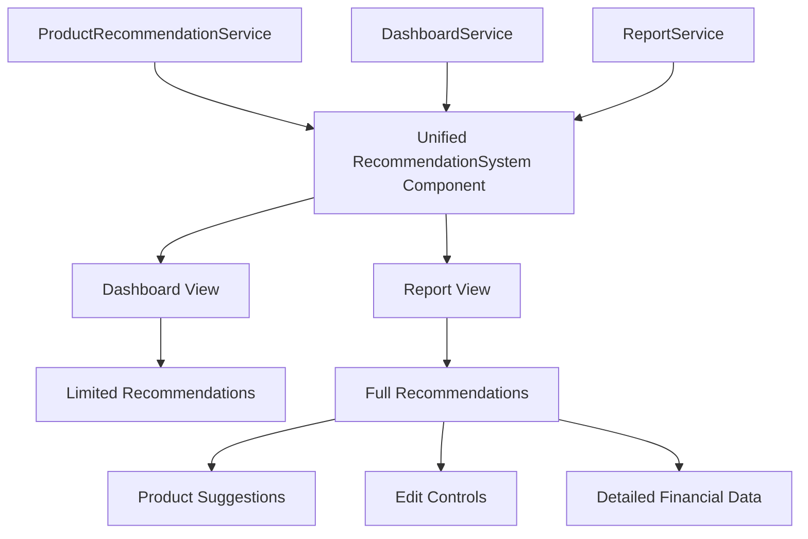

# Unified Recommendation System Implementation Plan

## Overview

This document outlines the implementation plan for creating a unified recommendation component that serves both the Dashboard and Reports sections of the Energy Audit platform. The goal is to eliminate code duplication, ensure consistent user experience, and simplify future maintenance.

## Project Goals

- Create a single recommendation component to serve both Dashboard and Reports views
- Ensure consistent functionality, filtering, and product suggestion across all views
- Maintain all existing functionality in both contexts
- Improve the presentation of recommendations based on user preferences
- Fix current issues with Amazon link generation and recommendation filtering
- Simplify maintenance by having a single source of truth

## Architecture Diagram



## Folder Structure

```
src/
└── components/
    ├── recommendations/               # New unified folder
    │   ├── UnifiedRecommendations.tsx # Main component
    │   ├── RecommendationCard.tsx     # Individual recommendation 
    │   ├── ProductSuggestionCard.tsx  # Existing component (moved)
    │   ├── RecommendationFilters.tsx  # Extracted filter functionality
    │   └── EditableFields/            # Sub-components for editable fields
    │       ├── StatusField.tsx
    │       ├── PriorityField.tsx
    │       └── SavingsField.tsx
    ├── dashboard/                     # Keep folder but update component
    ├── reports/                       # Keep folder but update component
```

## Detailed Implementation Checklist

### Phase 1: Project Setup and Planning (1-2 hours)

- [x] Create a new branch for implementation: `feature/unified-recommendation-system`
- [x] Document component interfaces and types
- [x] Review existing components for features to preserve
- [x] Set up folder structure for new unified components
- [x] Document dependent components and required updates

### Phase 2: Create Base Components (3-4 hours)

- [x] Create `recommendations` folder in `src/components/`
- [x] Define TypeScript interfaces for the unified component
- [x] Implement `UnifiedRecommendations.tsx` base component with props interface
- [x] Create `RecommendationCard.tsx` for individual recommendation display
- [x] Create `RecommendationFilters.tsx` for filtering logic
- [x] Move and update `ProductSuggestionCard.tsx` to the new folder
  - [x] Fix Amazon link generation to use specific product names
  - [x] Update imports in moved component
  - [x] Add proper category mapping for recommendations

### Phase 3: Implement Core Functionality (4-5 hours)

- [x] Implement display mode logic in the unified component
  - [x] `compact`: For Dashboard (limited info, no product cards)
  - [x] `detailed`: For Reports (full info with product cards)
  - [x] `interactive`: For Reports with edit controls
- [x] Extract and implement shared filtering logic
  - [x] Filter by user categories
  - [x] Show/hide all recommendations toggle
  - [x] Sort by priority
- [x] Implement product suggestions display
  - [x] Conditional rendering based on display mode
  - [x] Proper integration with product recommendation service
  - [x] Handle empty states gracefully
- [x] Implement conditional UI elements
  - [x] Limited recommendation count for Dashboard
  - [x] Full detailed view for Reports
  - [x] Edit controls for interactive mode

### Phase 4: Implement Interactive Features (3-4 hours)

- [x] Create editable field components for interactive mode
  - [x] Status field with active/implemented toggle
  - [x] Priority field with high/medium/low options
  - [x] Savings field for actual savings input
  - [x] Implementation details fields for date and cost
- [x] Implement callbacks for saving changes
- [x] Add loading and error states
- [x] Create edit history tracking functionality

### Phase 5: Integration (3-4 hours)

- [x] Update Dashboard to use unified component
  - [x] Replace `EnhancedDashboardRecommendations` with the adapter in DashboardOverview
  - [x] Pass appropriate props including `displayMode="compact"`
  - [x] Ensure "View All Recommendations" link works correctly
- [x] Update Reports to use unified component
  - [x] Replace `EnhancedReportRecommendations` with the adapter in InteractiveReportPage
  - [x] Pass appropriate props including `displayMode="interactive"`
  - [x] Ensure all edit functions are properly connected
- [x] Update `dashboardService.enhanced.ts` for consistency
  - [x] Ensure default recommendations cover all product categories
  - [x] Consistent financial data format across all recommendation types
  - [x] Add proper priority assignment logic

### Phase 6: Testing (3-4 hours)

- [ ] Unit test the unified component
  - [ ] Test each display mode renders correctly
  - [ ] Test filtering functionality
  - [ ] Test interactive features
- [ ] Integration test with Dashboard
  - [ ] Test with sample data
  - [ ] Test with empty state
  - [ ] Test with various user preferences
- [ ] Integration test with Reports
  - [ ] Test with sample data
  - [ ] Test with empty state
  - [ ] Test all interactive features
  - [ ] Test Amazon link generation
- [ ] Edge case testing
  - [ ] Test with many recommendations
  - [ ] Test with various recommendation types
  - [ ] Test with different budget constraints

### Phase 7: Documentation and Cleanup (1-2 hours)

- [ ] Add JSDoc comments to all components
- [ ] Update component props documentation
- [ ] Create usage examples for both contexts
- [ ] Remove deprecated components
  - [ ] Add deprecation notices for transition period
  - [ ] Plan for removal in future release
- [ ] Refactor any duplicated code
- [ ] Optimize imports and bundle size

### Phase 8: Deployment (2-3 hours)

- [ ] Build and test locally
  - [ ] Verify bundle size impact
  - [ ] Check for any console errors
- [ ] Create pull request with detailed description
- [ ] Deploy to staging environment
  - [ ] Verify functionality in staging
  - [ ] Check for any regressions
- [ ] Final review and adjustments
- [ ] Deploy to production
  - [ ] Monitor for errors
  - [ ] Verify all functionality works in production
  - [ ] Check both Dashboard and Reports views

## Technical Specifications

### Unified Component Props Interface

```typescript
interface UnifiedRecommendationsProps {
  // Core data
  recommendations: AuditRecommendation[];
  userCategories?: string[];
  budgetConstraint?: number;
  
  // Display configuration
  displayMode: 'compact' | 'detailed' | 'interactive';
  maxRecommendations?: number;
  showProductSuggestions?: boolean;
  
  // Interactive functionality
  auditId?: string | null;
  isLoading?: boolean;
  onRefresh?: () => void;
  
  // Edit functionality (for interactive mode)
  onUpdateStatus?: (id: string, status: 'active' | 'implemented', actualSavings?: number) => Promise<void>;
  onUpdatePriority?: (id: string, priority: RecommendationPriority) => Promise<void>;
  onUpdateImplementationDetails?: (id: string, date: string, cost: number) => Promise<void>;
  
  // Data source metadata
  isDefaultData?: boolean;
  dataSource?: 'detailed' | 'generated' | 'empty';
}
```

### RecommendationCard Props Interface

```typescript
interface RecommendationCardProps {
  recommendation: AuditRecommendation;
  displayMode: 'compact' | 'detailed' | 'interactive';
  productSuggestions?: ProductRecommendationMatch[];
  budgetConstraint?: number;
  
  // Interactive functionality
  onUpdateStatus?: (id: string, status: 'active' | 'implemented', actualSavings?: number) => Promise<void>;
  onUpdatePriority?: (id: string, priority: RecommendationPriority) => Promise<void>;
  onUpdateImplementationDetails?: (id: string, date: string, cost: number) => Promise<void>;
}
```

## Estimated Time and Resources

**Total Estimated Time**: 17-23 hours

**Breakdown by Phase**:
- Phase 1: 1-2 hours
- Phase 2: 3-4 hours
- Phase 3: 4-5 hours
- Phase 4: 3-4 hours
- Phase 5: 3-4 hours
- Phase 6: 3-4 hours
- Phase 7: 1-2 hours
- Phase 8: 2-3 hours

**Required Resources**:
- 1 Frontend Developer
- 1 Reviewer for code quality and testing assistance
- Testing environments for Dashboard and Reports

## Risk Assessment and Mitigation

### Potential Challenges

1. **Visual Consistency Across Views**
   - Risk: Components might look different in different contexts
   - Mitigation: Use consistent styling and extract shared style constants

2. **Feature Complexity**
   - Risk: Interactive features might interfere with simple view functionality
   - Mitigation: Clean separation of concerns in component architecture

3. **Performance Impact**
   - Risk: Unified component might be heavier than needed for Dashboard
   - Mitigation: Use code splitting and conditional imports for advanced features

4. **Legacy References**
   - Risk: Other components might directly import the old implementations
   - Mitigation: Scan codebase for imports and update all references

## Maintenance Benefits

Once implemented, this unified approach offers significant benefits:

1. **Single Source of Truth**: All recommendation display logic lives in one place
2. **Simplified Updates**: New features only need to be added once
3. **Consistent Experience**: Users see the same recommendations in both contexts
4. **Better Testing**: Consolidated testing ensures functionality works everywhere
